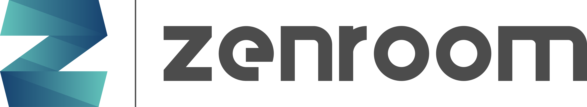

<!--
SPDX-FileCopyrightText: 2017-2022 Dyne.org foundation

SPDX-License-Identifier: AGPL-3.0-or-later
-->

# Zenroom crypto VM

[](https://zenroom.org)

Zenroom is a **secure language interpreter** of the domain-specific Zencode, making it easy to execute fast cryptographic operations on any data structure.

The Zenroom VM is very small, has **no external dependency**, is fully deterministic and is ready to run **end-to-end encryption** on any platform: desktop, embedded mobile, cloud micro-services, and web browsers. Zenroom works inside applications written in Javascript, Python3, Rust or Golang.

Zencode has a **no-code** approach. It is a domain-specific language (DSL) **similar to human language**. One can process large data structures through complex cryptographic and logical transformations.

Zencode helps developers to **empower people** who know what to do with data: one can write and review business logic and data-sensitive operations **without learning to code**.

<p align="center">
  <a href="https://dyne.org">
    
  </a>
</p>

## Timeline

- 2017 - Proof of Concept
- 2018 - Prototype and Alpha release series
- 2019 - Stable release series `v1` (now EOL)
- 2022 - Stable release series [v2](https://github.com/dyne/Zenroom/tree/v2) until LTS `v2.22.1`
- 2023 - Stable release series [v3](https://github.com/dyne/Zenroom/tree/v3) until LTS `v3.23.4`
- 2024 - Stable release series [v4](https://github.com/dyne/Zenroom/tree/v4) until LTS `v4.47.0`
- 2025 - Current stable `v5` (latest HEAD)

### [Read the full Changelog for more infos](https://github.com/dyne/Zenroom/blob/master/ChangeLog.md)

This software has zero dependencies. If you chose to use it in your
project be assured that we intend to support the same code to still
run in 20 years from now on any target platform.

## Links

Continue to the [developer website](https://dev.zenroom.org/)

or

Read the [Zencode whitepaper](https://files.dyne.org/zenroom/Zenroom_Whitepaper.pdf)

or

Visit the [product website](http://zenroom.org/) for a friendly
introduction to the love we put in craftsmanship.

For many quick running examples visit the
[ApiRoom](https://apiroom.net) online IDE powered by Zenroom.


**Zenroom is licensed as AGPLv3; we are [open to grant exceptions on a commercial basis](https://forkbomb.solutions).**

## Applications

Many applications already include Zenroom and use the Zencode language.

- [CREDIMI: EUDI-ARF wallet certification](https://credimi.io)
- [DIDROOM: EUDI and W3C VC wallet, verifier and issuer dashboard](https://didroom.com) 
- [W3C compatible Distributed Identity did:dyne](https://did.dyne.org)
- [Global Passport Project](https://globalpassportproject.org)
- [Keypairoom mnemonic deterministic and private keypairs](https://github.com/LedgerProject/keypairoom)
- [Simple Android app to show how to use Zenroom libs](https://github.com/dyne/Zenroom-Android-app)
- [Zexec safe remote execution of signed commands](https://github.com/dyne/zexec)
- [Micro-service to produce ECDSA signed unix timestamps](https://github.com/dyne/zenstamp)
- [Sawroom Transaction Processor for Hyperledger Sawtooth](https://github.com/dyne/sawroom)
- [RedRoom Crypto module for Redis](https://github.com/dyne/redroom)
- [Lotionroom Tendermint / Cosmos proof of concept with Zenroom](https://github.com/dyne/lotionroom)
- [ZenSchnorr API for Schnorr signatures](https://github.com/wires/zenschnorr)
- [Great Dane DNSSEC as a AV store for Zenroom](https://github.com/dyne/great-dane)
- [Zen-Web-Ext Web extensions encapsulating Zenroom functionality](https://github.com/LedgerProject/zen-web-ext)
- [Planetmint by the IPDB foundation](https://ipdb.io)

## Getting Started

To quickly try out Zenroom using the Zencode language with some
examples navigate to [ApiRoom](https://apiroom.net) and start typing
into the browser.

The Zenroom VM runs locally in your browser (needs WASM) and
[ApiRoom](https://apiroom.net) provides various examples to show
operational crypto flows.

[ApiRoom](https://apiroom.net) is also an IDE (Integrated Development
Environment) and by signing in with a username and password you can
save your contracts and download them as a Dockerfile micro-service
ready to deploy.

### Tutorials

- [Bitcoin secure off-line wallet](https://medium.com/think-do-tank/bitcoin-secure-off-line-wallet-be50a57a8474)
- [Easy Ethereum (and ERC20) transactions](https://medium.com/think-do-tank/easy-ethereum-transactions-with-zenroom-ac911a0bfdc0)
- [Quantum Proof Crypto](https://medium.com/think-do-tank/quantum-proof-cryptography-e23b165b3bbd)

## Build

Dependencies: makefile, cmake, gcc, libreadline-dev, xxd

Optional: musl-libc, emscripten for wasm builds

There are various build targets, just type make to have a list:

```
✨ Welcome to the Zenroom build system
🛟 Usage: make <target>
👇🏽 List of targets:
 posix-exe        Dynamic executable for generic POSIX
 posix-lib        Dynamic library for generic POSIX
 linux-exe        Dynamic executable for GNU/Linux
 linux-lib        Dynamic library for GNU/Linux
 debug-asan       Address sanitizer debug build
 debug-gprof      Address sanitizer debug build
 musl             Static executable for Musl
 win-exe          Executable for Windows x86 64bit
 win-dll          Dynamic lib (DLL) for Windows x86 64bit
 osx-exe          Executable for Apple MacOS
 osx-lib          Library for Apple MacOS native
 ios-armv7        Libraries for Apple iOS native armv7
 ios-arm64        Libraries for Apple iOS native arm64
 ios-sim          Libraries for Apple iOS simulator on XCode
 node-wasm        WebAssembly (WASM) for Javascript in-browser (Emscripten)
 check            Run tests using the current binary executable build
 check-js         Run tests using the WASM build for Node
 check-osx        Run tests using the OSX binary executable build
```

## License

Copyright (C) 2017-2026 Dyne.org foundation

Designed and written by Denis "[Jaromil](https://jaromil.dyne.org)"
Roio with the help of [Puria](https://github.com/puria) Nafisi Azizi
and [Andrea](https://www.linkedin.com/in/andrea-d-intino/) D'Intino.

Includes code contributions by Alberto Lerda, Matteo Cristino, Danilo
Spinella, Luca Di Domenico, Rebecca Selvaggini, Filippo Trotter, Nicola Suzzi, Giulio Sacchet.

Reviews and suggestions contributed by: Richard Stallman, Daniele
Lacamera, Enrico Zimuel, Sofía Celi, Sebastian Blichfeld, Adam Burns,
Thomas Fuerstner, Jürgen Eckel, Massimo Romano

Zenroom [complies with the REUSE license specification](https://api.reuse.software/info/github.com/dyne/zenroom) and redistributes:
- Lua 5.4 - Copyright © 1994–2025 Lua.org, PUC-Rio.
- Apache Milagro Crypto Library (AMCL)
- Various Lua libraries released under Apache/MIT/CC0 license

Special thanks to our colleagues in the [DECODE
project](https://decodeproject.eu) whose research has inspired the
birth of this project: Francesca Bria, George Danezis, Ola Bini, Mark
de Villiers, Ivan Jelincic, Alberto Sonnino, Jim Barritt, Christian
Espinoza, Samuel Mulube and Nina Boelsums.

This program is free software: you can redistribute it and/or modify
it under the terms of the GNU Affero General Public License as
published by the Free Software Foundation, either version 3 of the
License, or (at your option) any later version.

This program is distributed in the hope that it will be useful, but
WITHOUT ANY WARRANTY; without even the implied warranty of
MERCHANTABILITY or FITNESS FOR A PARTICULAR PURPOSE.  See the GNU
Affero General Public License for more details.

You should have received a copy of the GNU Affero General Public
License along with this program.  If not, see
<https://www.gnu.org/licenses/>.
