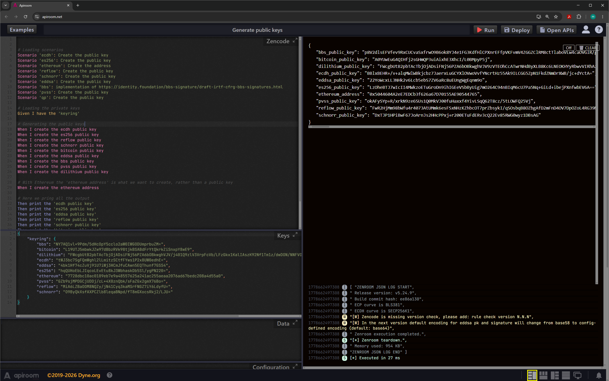

<!--
SPDX-FileCopyrightText: 2017-2026 Dyne.org foundation

SPDX-License-Identifier: AGPL-3.0-or-later
-->

<div align="center">

# Zenroom crypto VM <!-- omit in toc -->

## No-code cryptographic virtual machine <!-- omit in toc -->

<a href="https://zenroom.org">
  
</a>
</div>
<br><br>

## 📋 Zenroom Features <!-- omit in toc -->

Zenroom is a **tiny, portable, and fully isolated crypto VM** for building privacy-preserving applications, smart contracts, and secure data workflows.

It runs deterministically across platforms — from browsers and mobile apps to embedded devices, cloud services, and blockchains — with **no external dependencies** and a small runtime footprint.

With **Zencode**, Zenroom lets developers express cryptographic logic in a human-readable language, making advanced operations such as signatures, hashing, zero-knowledge proofs, credentials, and blockchain interoperability easier to write, review, and deploy.

---

<div id="toc">

### 🚩 Table of contents <!-- omit in toc -->

- [🎮 Quick start](#-quick-start)
- [💾 Build](#-build)
- [🧩 Projects using Zenroom](#-projects-using-zenroom)
- [⌛ Timeline](#-timeline)
- [👤 Contributing](#-contributing)
- [💼 License](#-license)
- [🗞️ More information](#️-more-information)

</div>

---
## 🎮 Quick start

Read the [documentation](https://dev.zenroom.org/) and run quick examples using the online IDE powered by Zenroom: [ApiRoom](https://apiroom.net).
<div align=center>

</div>

**[🔝 back to top](#toc)**

---
## 💾 Build

After have installed the following dependencies:
* makefile
* cmake
* gcc
* libreadline-dev
* xxd

You can build zenroom as executable or C library. There are various build targets, just type make to have a list:

```
✨ Welcome to the Zenroom build system
🛟 Usage: make <target>
👇🏽 List of targets:
 posix-exe        Dynamic executable for generic POSIX
 posix-lib        Dynamic library for generic POSIX
 linux-exe        Dynamic executable for GNU/Linux
 linux-lib        Dynamic library for GNU/Linux
 debug-asan       Address sanitizer debug build
 debug-gprof      Address sanitizer debug build
 musl             Static executable for Musl
 win-exe          Executable for Windows x86 64bit
 win-dll          Dynamic lib (DLL) for Windows x86 64bit
 osx-exe          Executable for Apple MacOS
 osx-lib          Library for Apple MacOS native
 ios-armv7        Libraries for Apple iOS native armv7
 ios-arm64        Libraries for Apple iOS native arm64
 ios-sim          Libraries for Apple iOS simulator on XCode
 node-wasm        WebAssembly (WASM) for Javascript in-browser (Emscripten)
 check            Run tests using the current binary executable build
 check-js         Run tests using the WASM build for Node
 check-osx        Run tests using the OSX binary executable build
```

Optional dependencies are:
* [dyne musl-gcc](https://github.com/dyne/musl/) to build the musl target
* [Emscripten](https://emscripten.org/) for wasm builds

**[🔝 back to top](#toc)**

---
## 🧩 Projects using Zenroom

Many applications already include Zenroom and use the Zencode language:

- [CREDIMI: EUDI-ARF wallet certification](https://credimi.io)
- [DIDROOM: EUDI and W3C VC wallet, verifier and issuer dashboard](https://didroom.com) 
- [W3C compatible Distributed Identity did:dyne](https://did.dyne.org)
- [Global Passport Project](https://globalpassportproject.org)
- [Keypairoom mnemonic deterministic and private keypairs](https://github.com/LedgerProject/keypairoom)
- [Simple Android app to show how to use Zenroom libs](https://github.com/dyne/Zenroom-Android-app)
- [Zexec safe remote execution of signed commands](https://github.com/dyne/zexec)
- [Micro-service to produce ECDSA signed unix timestamps](https://github.com/dyne/zenstamp)
- [Sawroom Transaction Processor for Hyperledger Sawtooth](https://github.com/dyne/sawroom)
- [RedRoom Crypto module for Redis](https://github.com/dyne/redroom)
- [Lotionroom Tendermint / Cosmos proof of concept with Zenroom](https://github.com/dyne/lotionroom)
- [ZenSchnorr API for Schnorr signatures](https://github.com/wires/zenschnorr)
- [Great Dane DNSSEC as a AV store for Zenroom](https://github.com/dyne/great-dane)
- [Zen-Web-Ext Web extensions encapsulating Zenroom functionality](https://github.com/LedgerProject/zen-web-ext)
- [Planetmint by the IPDB foundation](https://ipdb.io)

**[🔝 back to top](#toc)**

---
## ⌛ Timeline

- 2017 - Proof of Concept
- 2018 - Prototype and Alpha release series
- 2019 - Stable release series `v1` (now EOL)
- 2022 - Stable release series [v2](https://github.com/dyne/Zenroom/tree/v2) until LTS `v2.22.1`
- 2023 - Stable release series [v3](https://github.com/dyne/Zenroom/tree/v3) until LTS `v3.23.4`
- 2024 - Stable release series [v4](https://github.com/dyne/Zenroom/tree/v4) until LTS `v4.47.0`
- 2025 - Current stable `v5` (latest HEAD)

**[🔝 back to top](#toc)**

---
## 👤 Contributing

1.  🔀 [FORK IT](../../fork)
2.  Create your feature branch `git checkout -b feature/branch`
3.  Commit your changes `git commit -am 'feat: New feature\ncloses #398'`
4.  Push to the branch `git push origin feature/branch`
5.  Create a new Pull Request `gh pr create -f`
6.  🙏 Thank you

**[🔝 back to top](#toc)**

---
## 💼 License

Copyright (C) 2017-2026 Dyne.org foundation

Designed and written by Denis "[Jaromil](https://jaromil.dyne.org)"
Roio with the help of [Puria](https://github.com/puria) Nafisi Azizi
and [Andrea](https://www.linkedin.com/in/andrea-d-intino/) D'Intino.

Includes code contributions by Alberto Lerda, Matteo Cristino, Danilo
Spinella, Luca Di Domenico, Rebecca Selvaggini, Filippo Trotter, Nicola Suzzi, Giulio Sacchet.

Reviews and suggestions contributed by: Richard Stallman, Daniele
Lacamera, Enrico Zimuel, Sofía Celi, Sebastian Blichfeld, Adam Burns,
Thomas Fuerstner, Jürgen Eckel, Massimo Romano

Zenroom [complies with the REUSE license specification](https://api.reuse.software/info/github.com/dyne/zenroom) and redistributes:
- Lua 5.4 - Copyright © 1994–2025 Lua.org, PUC-Rio.
- Apache Milagro Crypto Library (AMCL)
- Various Lua libraries released under Apache/MIT/CC0 license

Special thanks to our colleagues in the [DECODE
project](https://decodeproject.eu) whose research has inspired the
birth of this project: Francesca Bria, George Danezis, Ola Bini, Mark
de Villiers, Ivan Jelincic, Alberto Sonnino, Jim Barritt, Christian
Espinoza, Samuel Mulube and Nina Boelsums.

This program is free software: you can redistribute it and/or modify
it under the terms of the GNU Affero General Public License as
published by the Free Software Foundation, either version 3 of the
License, or (at your option) any later version.

This program is distributed in the hope that it will be useful, but
WITHOUT ANY WARRANTY; without even the implied warranty of
MERCHANTABILITY or FITNESS FOR A PARTICULAR PURPOSE.  See the GNU
Affero General Public License for more details.

You should have received a copy of the GNU Affero General Public
License along with this program.  If not, see
<https://www.gnu.org/licenses/>.


**[🔝 back to top](#toc)**

---
## 🗞️ More information

* Product website: http://zenroom.org/
* Zenroom developer website: https://dev.zenroom.org/
* Zencode whitepaper: https://files.dyne.org/zenroom/Zencode_Whitepaper.pdf
* Tutorials:
  * [Bitcoin secure off-line wallet](https://news.dyne.org/bitcoin-secure-off-line-wallet/)
  * [Easy Ethereum (and ERC20) transactions](https://news.dyne.org/easy-ethereum-transactions-with-zenroom/)
  * [Quantum Proof Crypto](https://news.dyne.org/quantum-proof-cryptography-made-easy-with-zenroom/)

**[🔝 back to top](#toc)**

---

<p align="center">
  <a href="https://dyne.org">
    
  </a>
</p>
