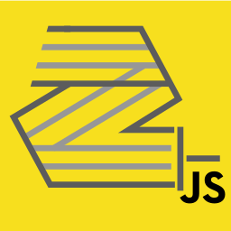

<h1 align="center">
  <br>
	<a href="https://zenroom.dyne.org">
		
	</a>
  <br>
  Zenroomjs
  <br>
</h1>

<table><tr><td>
<h4 align="center">
Zenroomjs provides a javascript wrapper of <a href="https://zenroom.dyne.org">Zenroom</a>, a secure and small virtual machine for crypto language processing.
</h4>
  
<p align="center">
  <a href="https://travis-ci.com/DECODEproject/zenroomjs">
    
  </a>
  <a href="https://codecov.io/gh/DECODEproject/zenroomjs">
    
  </a>
  <a href="https://badge.fury.io/js/zenroom">
    
  </a>
  <a href="https://dyne.org">
    
  </a>
</p>

<br><br>

<div align="center">
  <h3>
    <a href="#floppy_disk-install">:floppy_disk: Install</a>
    <span> • </span>
    <a href="#video_game-usage">:video_game: Usage</a>
    <span> • </span>
    <a href="#heart_eyes-acknowledgements">:heart_eyes: Acknowledgements</a>
    <span> • </span>
    <a href="#busts_in_silhouette-contributing">:busts_in_silhouette: Contributing</a>
    <span> • </span>
    <a href="#briefcase-license">:briefcase: License</a>
  </h3>
</div>

<br><br>

:construction: Zenroom and Zenroomjs are part of the [DECODE project](https://decodeproject.eu) about data-ownership and [technological sovereignty](https://www.youtube.com/watch?v=RvBRbwBm_nQ). Our effort is that of improving people's awareness of how their data is processed by algorithms, as well facilitate the work of developers to create along [privacy by design principles](https://decodeproject.eu/publications/privacy-design-strategies-decode-architecture) using algorithms that can be deployed in any situation without any change.

<br>
</td></tr></table>

## :floppy_disk: Install

```bash
yarn add zenroom
```

* * *

## :video_game: Usage

To start using the zenroom module just

```js
const zenroom = require('zenroom').default
```

or with ES6 syntax:

```js
import zenroom from 'zenroom'
```

the zenroomjs module is architectured as a [Revealing Module Pattern](https://addyosmani.com/resources/essentialjsdesignpatterns/book/#revealingmodulepatternjavascript) this also means that once you set some options it will remain till the object lifetime, unless you reset or overwrite them.

Another used paradigm is method chaining this means that you can chain the different methods, let's see some hello worldish example:

```js
import zenroom from 'zenroom'
// or without es6 syntax
// const zenroom = require('zenroom').default

const script = `print("hello world from zenroom in nodejs")`
zenroom.script(script).zenroom_exec()

// prints in the console.log "hello world from zenroom in nodejs"
```

To initialize the options there are two ways, the one with the chaining that we saw before or a handy `init()` method to make them in one shot

```js
// method chaining
zenroom.script('print("hello world")')
       .verbosity(1)
       .success(() => { console.log('everything goes smooth') })
       .error(() => { console.error('something very bad happened') })
       .zenroom_exec()
       .reset() // cleans up the session
```

```js
// using the init() method
options = {
	script: 'print("hello world")',
	verbosity: 1,
	success: () => { console.log('everything goes smooth') },
	error: () => { console.error('something very bad happened') }
}

zenroom.init(options).zenroom_exec()
```

All the available options and method are covered in the next API section

* * *

### :honeybee: API

<!-- Generated by documentation.js. Update this documentation by updating the source code. -->

#### script

Set the zenroom script to run

The syntax of the zenroom scripts are extensively available at
<https://zenroom.dyne.org/api/tutorials/Syntax.html>
You may want also to look at some example in a live executable environment here <https://zenroom.dyne.org/demo/>

##### Parameters

-   `script` **[string](https://developer.mozilla.org/docs/Web/JavaScript/Reference/Global_Objects/String)** the lua script to be set

##### Examples

Example usage of `script()`


```javascript
// returns zenroom
import zenroom from 'zenroom'
// or without ES6 syntax
// const zenroom = require('zenroom').default

const script = 'print("hello")'
zenroom.script(script).zenroom_exec().reset()
```

Returns **zenroom** the zenroom module

#### keys

Set the keys JSON for you zenroom execution

the keys will be available in script as the `KEYS` variable

##### Parameters

-   `keys` **[object](https://developer.mozilla.org/docs/Web/JavaScript/Reference/Global_Objects/Object)** the keys to be set as an object

##### Examples

Example usage of `keys()`


```javascript
// returns zenroom
import zenroom from 'zenroom'
// or without ES6 syntax
// const zenroom = require('zenroom').default

const script = `
                 keys = JSON.decode(KEYS)
                 print(keys)
`

const keys = {a: 1, b: 2}
zenroom.script(script).keys(keys).zenroom_exec().reset()
```

Returns **[object](https://developer.mozilla.org/docs/Web/JavaScript/Reference/Global_Objects/Object)** the zenroom module

#### conf

Set the conf before your zenroom execution

by now the only conf available is the string `umm` that sets the minimal memory manager (64KiB max)

##### Parameters

-   `conf` **[string](https://developer.mozilla.org/docs/Web/JavaScript/Reference/Global_Objects/String)** the string of configuration to be set

##### Examples

Example usage of `conf()`


```javascript
// returns zenroom
import zenroom from 'zenroom'
// or without ES6 syntax
// const zenroom = require('zenroom').default

const script = 'print("hello")'
const conf = 'umm'
zenroom.script(script).conf(conf).zenroom_exec()
```

Returns **[object](https://developer.mozilla.org/docs/Web/JavaScript/Reference/Global_Objects/Object)** the zenroom module

#### data

Set the data for your zenroom execution

The data will be available in script as the `DATA` variable

##### Parameters

-   `data` **[string](https://developer.mozilla.org/docs/Web/JavaScript/Reference/Global_Objects/String)** 

##### Examples

Example usage of `data()`


```javascript
// returns zenroom
import zenroom from 'zenroom'
// or without ES6 syntax
// const zenroom = require('zenroom').default

const script = `
                 data = JSON.decode(DATA)
                 print(data)
`

const data = {a: 1, b: 2}
zenroom.script(script).data(data).zenroom_exec()
```

Returns **[object](https://developer.mozilla.org/docs/Web/JavaScript/Reference/Global_Objects/Object)** the zenroom module

#### print

Set the print callback to customize
the behaviour of the print calls made to stdout
by default it prints to the console.log

Type: [Function](https://developer.mozilla.org/docs/Web/JavaScript/Reference/Statements/function)

##### Examples

Example usage of `print()`


```javascript
// returns zenroom
import zenroom from 'zenroom'
// or without ES6 syntax
// const zenroom = require('zenroom').default

const savedLines = []
const printFunction = (text) => { savedLines.push(text) }
const script = 'print("hello")'
zenroom.print(printFunction).script(script).zenroom_exec()
```

Returns **[object](https://developer.mozilla.org/docs/Web/JavaScript/Reference/Global_Objects/Object)** the zenroom module

#### success

Set the success callback that is executed after a successful execution of zenroom

Type: [Function](https://developer.mozilla.org/docs/Web/JavaScript/Reference/Statements/function)

##### Examples

Example usage of `success()`


```javascript
// returns zenroom
import zenroom from 'zenroom'
// or without ES6 syntax
// const zenroom = require('zenroom').default

const script = 'print("hello")'
zenroom.script(script).success(()=>{
   pleaseRunSomeOtherMethodAfter()
}).zenroom_exec()
```

Returns **[object](https://developer.mozilla.org/docs/Web/JavaScript/Reference/Global_Objects/Object)** the zenroom module

#### error

Set the error callback that is executed after an unsuccessful execution of zenroom

Type: [Function](https://developer.mozilla.org/docs/Web/JavaScript/Reference/Statements/function)

##### Examples

Example usage of `error()`


```javascript
// returns zenroom
import zenroom from 'zenroom'
// or without ES6 syntax
// const zenroom = require('zenroom').default

const script = 'print("hello")';
zenroom.script(script).error(()=>{
   pleaseRunSomeOtherMethodAfterError()
}).zenroom_exec()
```

Returns **[object](https://developer.mozilla.org/docs/Web/JavaScript/Reference/Global_Objects/Object)** the zenroom module

#### verbosity

Set the verbosity of the stderr messages outputted by the zenroom virtual machine

As per now the set of accepted value:

<ul>
<li>1 = INFO</li>
<li>2 = DEBUG</li>
</ul>

##### Parameters

-   `verbosity` **[number](https://developer.mozilla.org/docs/Web/JavaScript/Reference/Global_Objects/Number)** 

##### Examples

Example usage of `verbosity()`


```javascript
// returns zenroom
import zenroom from 'zenroom'
// or without ES6 syntax
// const zenroom = require('zenroom').default

const script = 'print("hello")'
zenroom.script(script).verbosity(2).zenroom_exec()
```

Returns **[object](https://developer.mozilla.org/docs/Web/JavaScript/Reference/Global_Objects/Object)** the zenroom module

#### zenroom_exec

Execute the zenroom vm (using the previously setted options)

It is usually the last method of the chain, but like the other methods returns
the zenroom module itself, so can be used for other calls if you need to make more
executions in a row

##### Examples

Example usage of `zenroom_exec()`


```javascript
// returns zenroom
import zenroom from 'zenroom'
// or without ES6 syntax
// const zenroom = require('zenroom').default

const script = 'print("hello")';
zenroom.script(script).zenroom_exec()
```

Returns **[object](https://developer.mozilla.org/docs/Web/JavaScript/Reference/Global_Objects/Object)** the zenroom module

#### zencode_exec

Execute zencode contracts (using the previously setted options)

It is usually the last method of the chain, but like the other methods returns
the zenroom module itself, so can be used for other calls if you need to make more
executions in a row

##### Examples

Example usage of `zencode_exec()`


```javascript
// returns zenroom
import zenroom from 'zenroom'
// or without ES6 syntax
// const zenroom = require('zenroom').default

const zencode = 'print("hello")';
zenroom.script(script).zencode_exec()
```

Returns **[object](https://developer.mozilla.org/docs/Web/JavaScript/Reference/Global_Objects/Object)** the zenroom module

#### init

This method allows the configuration of your call by passing one
configuration option object. You can use the chain methods after this anyway.

If some attribute is already set, those will be overwritten by the new options

The following options are available:

<ul>
  <li><strong>script</strong></li>
  <li><strong>keys</strong></li>
  <li><strong>conf</strong></li>
  <li><strong>data</strong></li>
  <li><strong>print</strong></li>
  <li><strong>success</strong></li>
  <li><strong>error</strong></li>
  <li><strong>verbosity</strong></li>
</ul>

##### Parameters

-   `options`  

##### Examples

Example usage of `init()`


```javascript
// returns zenroom
import zenroom from 'zenroom'
// or without ES6 syntax
// const zenroom = require('zenroom').default

const encrypt_secret_to_many = {
 script: `keyring = ECDH.new()
           secret = str(DATA)
           keys = JSON.decode(KEYS)
           keyring:private( base64(keys.keyring.secret) )
           res = {}
           for name,pubkey in pairs(keys.recipients) do
             pub = base64(pubkey)
             enc = ECDH.encrypt(keyring,pub,secret,keyring:public())
             res[name] = str( MSG.pack( map(enc,base64) ) ):base64()
           end
           print(JSON.encode(res))`,

 keys: {
     keyring : {
       public : "BHMjcDM/aljpi8pNxFQ436R6F3J+kaB/Xk1kAVFPmkoLVyeFltDZPgiIYRquh+m2IfvPioBfet7YCd5vVXYoRTk=",
       secret : "ChW5qi5y//ISDIHKx5Fvxl+XY8IyDGVBHUfELp3PqJQ="
     },
     recipients : {
       paulus : "BBUw6Nr3A30cN65maERvAk1cEv2Ji6Vs80kSlpodOC0SCtM8ucaS7e+s158uVMSr3BsvIXVspBeafiL8Qb3kcgc=",
       mayo : "BHqBoQ2WJ3/FGVNTXzdIc+K/HzNx05bWzEhn8m58FvSsaqWVdH52jI6fQWdkdjnbqVKCJGmbjA/OCJ+IKHbiySI=",
       mark : "BFgkjrRMvN+wkJ6qA4UvMaNlYBvl37C9cNYGkqOE4w43AUzkEzcyIIdE6BrgOEUEVefhOOnO6SCBQMgXHXJUUPY=",
       francesca : "BCo102mVybieKMyhex8tnVtFM5+Wo1oP02k8JVwKF9OLIjw7w0LmofItbuAcfWl9rcoe++XLI3sySZnqljIfeyU=",
       jim : "BEs1jeqL0nVwFi7OmG4YdtlWuKADyOvZR4XHpLAEswg8ONPXQHvwJ8+PkHkphoORfSjk2045bMdYkwboU4FdG2Y=",
       jaromil : "BBZYJtHvFg0vGCxPROAWrThcGZ+vFZJj86k+uncjvbm4DysIg7cWS3J6GrcJKCY55Uf40m2KfBwfaT+T7TTO1e8="
     }
 },

 data: 'This is a secret message.'
}


zenroom.init(encrypt_secret_to_many).zenroom_exec()
```

Returns **[object](https://developer.mozilla.org/docs/Web/JavaScript/Reference/Global_Objects/Object)** the zenroom module

#### reset

Reset the setted options already provided and cleans up the zenroom module

It is usually the last method of the chain, but like the other methods returns
the zenroom module itself, so can be used for other calls if you need to make more
executions in a row

##### Examples

Example usage of `reset()`


```javascript
// returns zenroom
import zenroom from 'zenroom'
// or without ES6 syntax
// const zenroom = require('zenroom').default

const script = 'print("hello")';
zenroom.script(script)
       .zenroom_exec()    // This runs the script
       .reset()
       .zenroom_exec()    // This does not run the script anymore
```

Returns **[object](https://developer.mozilla.org/docs/Web/JavaScript/Reference/Global_Objects/Object)** the zenroom module

## :heart_eyes: Acknowledgements

Copyright (C) 2018 by [Dyne.org](https://www.dyne.org) foundation, Amsterdam

Designed, written and maintained by Puria Nafisi Azizi.


This project is receiving funding from the European Union’s Horizon 2020 research and innovation programme under grant agreement nr. 732546 (DECODE).

* * *

## :busts_in_silhouette: Contributing

Please first take a look at the [Dyne.org - Contributor License Agreement](CONTRIBUTING.md) then

1.  [FORK IT](https://github.com/puria/zenroomjs/fork)
2.  Create your feature branch `git checkout -b feature/branch`
3.  Commit your changes `git commit -am 'Add some fooBar'`
4.  Push to the branch `git push origin feature/branch`
5.  Create a new Pull Request
6.  Thank you

* * *

## :briefcase: License

      Zenroomjs - a javascript wrapper of zenroom
      Copyright (c) 2019 Dyne.org foundation, Amsterdam

      This program is free software: you can redistribute it and/or modify
      it under the terms of the GNU Affero General Public License as
      published by the Free Software Foundation, either version 3 of the
      License, or (at your option) any later version.

      This program is distributed in the hope that it will be useful,
      but WITHOUT ANY WARRANTY; without even the implied warranty of
      MERCHANTABILITY or FITNESS FOR A PARTICULAR PURPOSE.  See the
      GNU Affero General Public License for more details.

      You should have received a copy of the GNU Affero General Public License
      along with this program.  If not, see <http://www.gnu.org/licenses/>.
