<!-- Unused files 
 
givenDebugOutputVerbose.json
givenLongOutput.json
 

Link file with relative path: <a href="./_media/examples/zencode_cookbook/givenArraysLoadInput.json">givenArraysLoadInput.json</a>
 
-->


This is the user manual of Zenroom's web playground [Apiroom](https://apiroom.net). Apiroom has built in: 

 - A [Zencode](/pages/zencode-intro) editor, equipped with auto-complete and syntax highlight
 - An in-the-browser Zenroom instance: you can use the editor to test your smart contracts and run them inside your browser window
 - An instance of [Restroom-mw](/pages/restroom-mw) that enables you to create an API from a Zencode smart contract with one click
 - An instance of [Swagger ](https://swagger.io/) that you can use to test and debug the APIs you created

# Getting started

When landing on [Apiroom](https://apiroom.net) you're prompted with its front-end, where you have: 

- The text box **Zencode smart contract**: use it to type your [Zencode](pages/zencode-cookbook-intro) scripts
- The text boxes **Keys** and **Data**: use them to pass different kind of data to Zenroom, as you would do with the parameters **-k** and **-a** respectively from the command line application
 - The **Examples** drop-down menu fills the text boxes with sample Zencode smart contracts
- The text box named **Config**: use it to pass [configuration](/pages/zenroom-config) files to Zenroom (in the front end only)
- The **Run ▶️** button: use it to execute the smart contracts, along with the keys and data you provided
- An output box shows the output of the Zencode smart contract you executed

And also:

<!-- - The **💾 Deploy** button saves your smart contract and create an API from it (you need to be logged in to use it) -->
- The **Login** button allows you to login and create an account
<!-- - Once logged in, the **Open APIs** button is used to check, test and debug the APIs created from your Zencode smart contracts -->

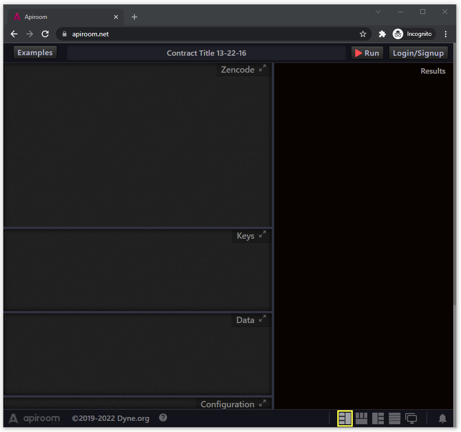

# Let's start with an example: Generate a keypair

Press the **Examples** drop-down menu, and click on *Generate a keypair*

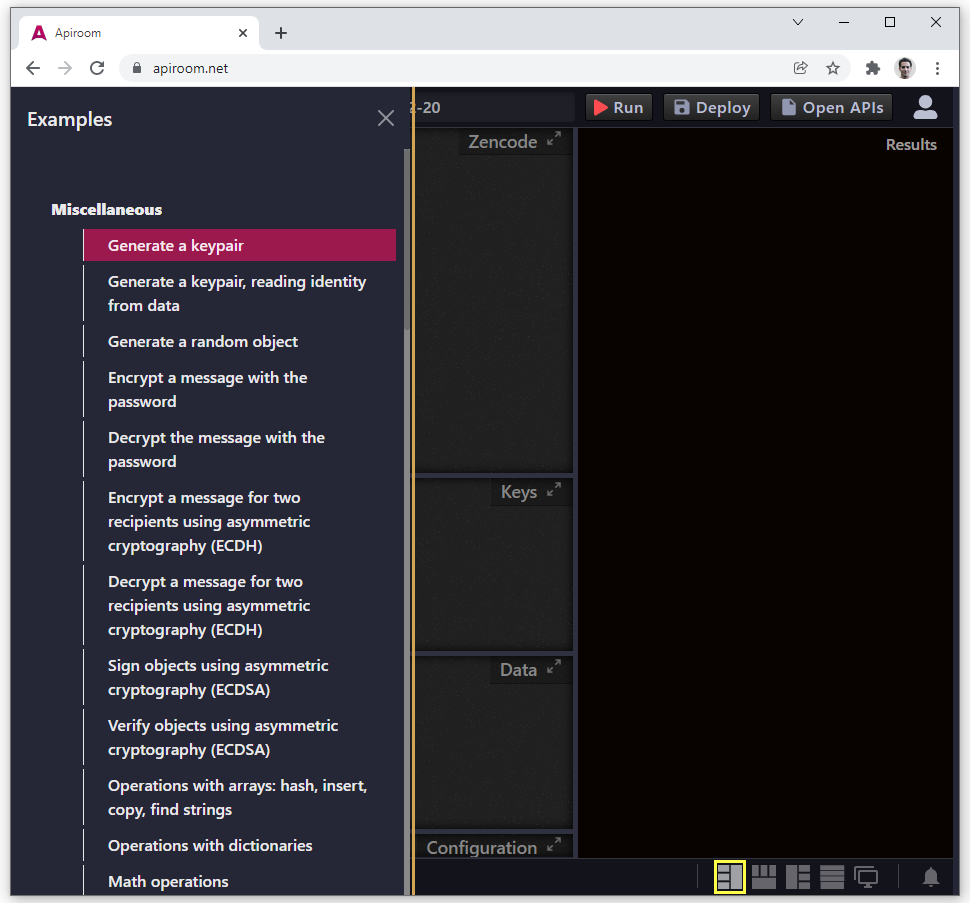

## Running a script 

After that, press the **Run▶️** button, and you should be presented with an [ecdh keypair](/pages/zencode-scenarios-ecdh?id=generate-a-keypair) in the **Result** box, looking like this:

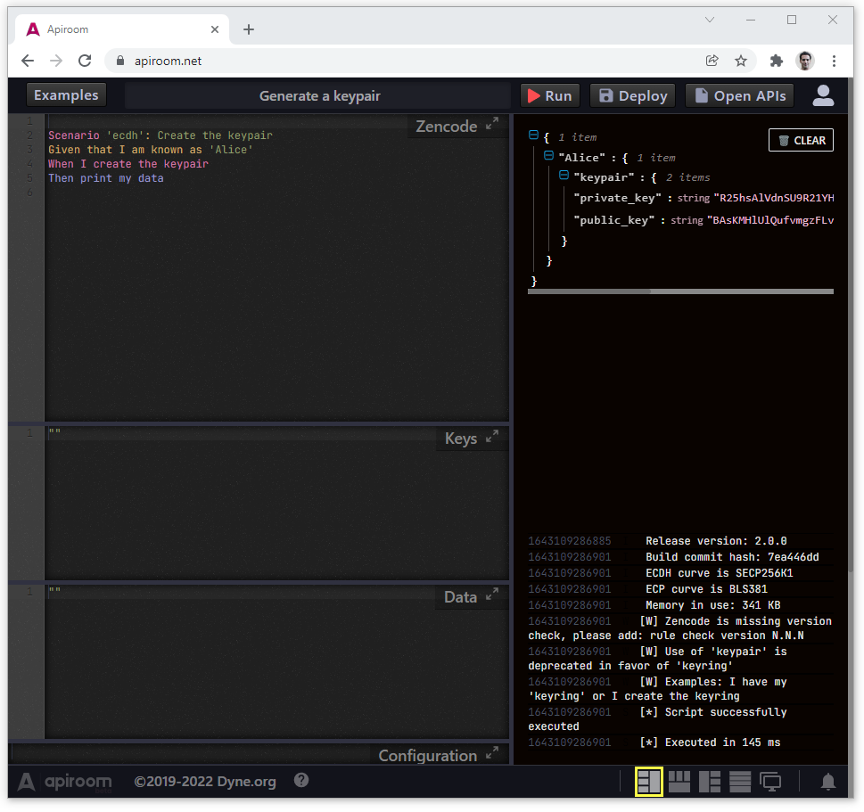


# The auto-complete function

Now, in the **Zencode smart contract** text box, try and type *random*: the auto-complete should be triggered, prompting you a window like this:

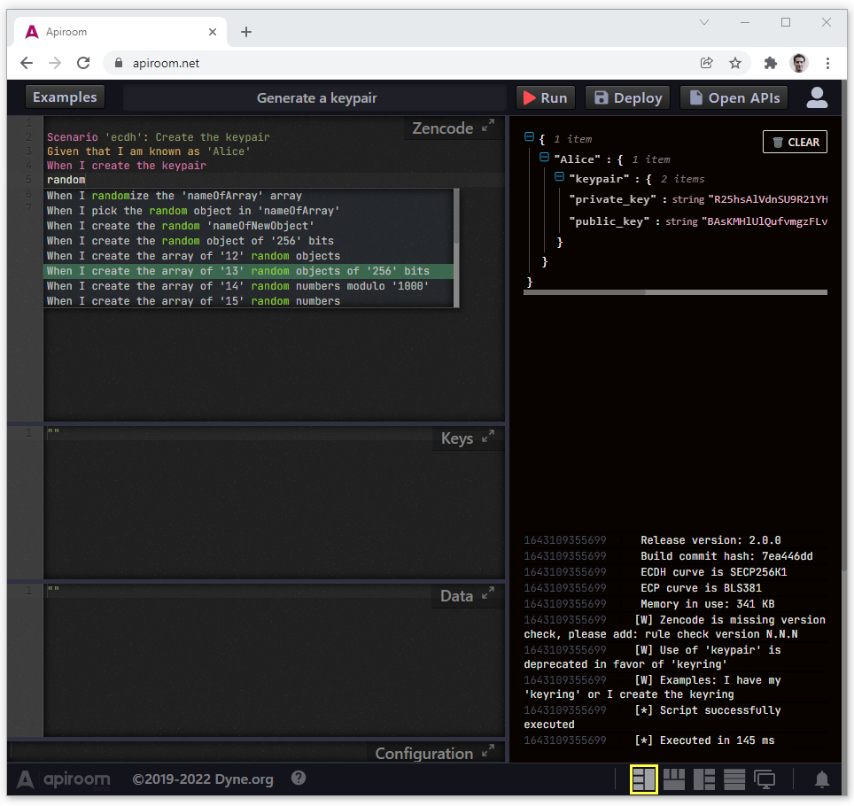

## Mastering the auto-complete

The auto-complete window is based on the [Ace editor](https://ace.c9.io/), it allows you to scroll up and down with keyboard arrows, and by clicking or pressing enter, the selected line will be inserted. 
A smart way to use it is to **think of a function** (e.g. **hash**, **random**, **print** or anything you find in the Zencode manual) and let the auto-complete find all the relevant statements for your. 
The lines inserted will typically include a *dummy object name*, which some times will work straight of the box (like the example highlighted in the screenshot) but more often will need some adjustment. For example, the second statement from top:

```gherkin
When I create the 'nameOfNewObject'
```

will work and create a generic **simple object** named ***nameOfNewObject***. If you change ***nameOfNewObject*** to ***justThrowSomeName***, the statement will still work, cause its job is to create a new object whose name is defined between the quotation marks

But in the statement that is under it in the screenshot, we are in a very different situation: 

```gherkin
When I create the aggregation array of 'nameOfArray'
```

Here the statement is meant the perform the [aggregation](/pages/zencode-cookbook-when?id=basic-cryptography-hashing) of an array of ECP/ECP2 points (a cryptographical operation), so it's expecting to be with an existing array. Therefore, as things are now, the statement will not work and throw an error.

If we look instead at the first statement in the screenshot, we first read: 

```gherkin
When I create a petition tally 
```

Followed by *scenario 'petition'* printed in a different color: this part indicates that in order to execute the statement, you need to load the [scenario 'petition'](/pages/zencode-scenarios-petition) in the top of the Zencode smart contract, as we did with the [scenario 'ecdh'](/pages/zencode-scenarios-ecdh) when we generated the keypair. Executing the script without the scenario will throw an error.


## The syntax highlight

The syntax highlight does not perform a syntax check, it's only there to help you read the Zencode smart contract easily, namely to help you make sure you are using the **Given**, **When** and **Then** statements as they should, in the right order.

# Deploy: turn a smart contract into a REST API

If you aren't yet logged in, you can see the button **Login** (you'll need to register an account for that). After Signing up and logging in, you will be able to see **💾 Deploy** button, along with the **🗋 Open APIs** button


Press the **💾 Deploy** button to save it as an API:

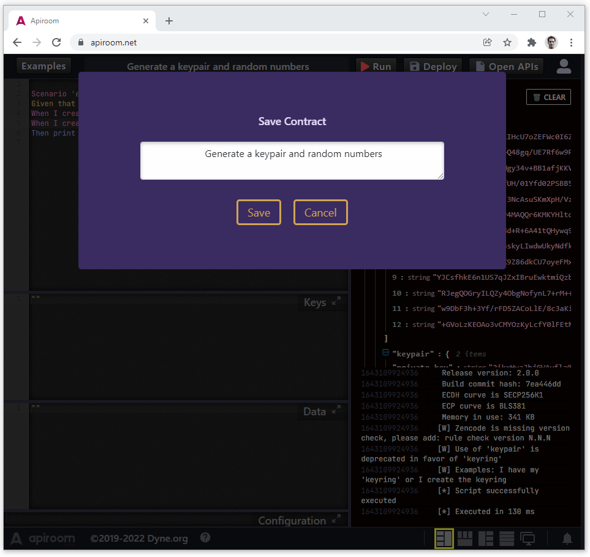

# A smart contract just turned into an API?

The smart contract you have just saved under the name **My Fancy Smart Contract** is now deployed on Apiroom on the endpoint: 

https://apiroom.net/api/YourUserName/My-Fancy-Smart-Contract


The easiest way to explain this is by demonstrating it, just click on the link [https://apiroom.net/api/dyneorg/Create-a-keypair](https://apiroom.net/api/dyneorg/Create-a-keypair) and you should see something like this: 

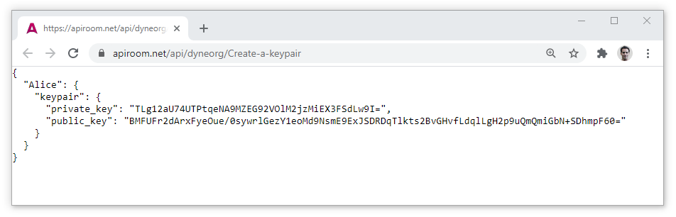

If you refresh the page, you will get every time a new keypair. The keypair is being generated on Apiroom's server by [Restroom-mw](https://dyne.github.io/restroom-mw/#/) and you can call the API with a POST. 

**IMPORTANT**: what you stored in **Data** in the front-end editor is stored here for reference only and ***will not be loaded as the smart-contract is exposed to an API in Restroom-mw***, so if the smart contract you are trying to use needs something inside **Data** to run, the output will be an error (more about this later).


# Check your APIs: Apiroom's right hand sidebar 

If you aren't yet logged in, you can see the button **Login** (you'll need to register an account for that). After logging in, you will be able to see **💾 Deploy** button, along with the **🗋 Open APIs** button. 

By pressing **💾 Deploy** you are prompted with a pop-up asking you the name you want to give to the API, turned into APIs: 


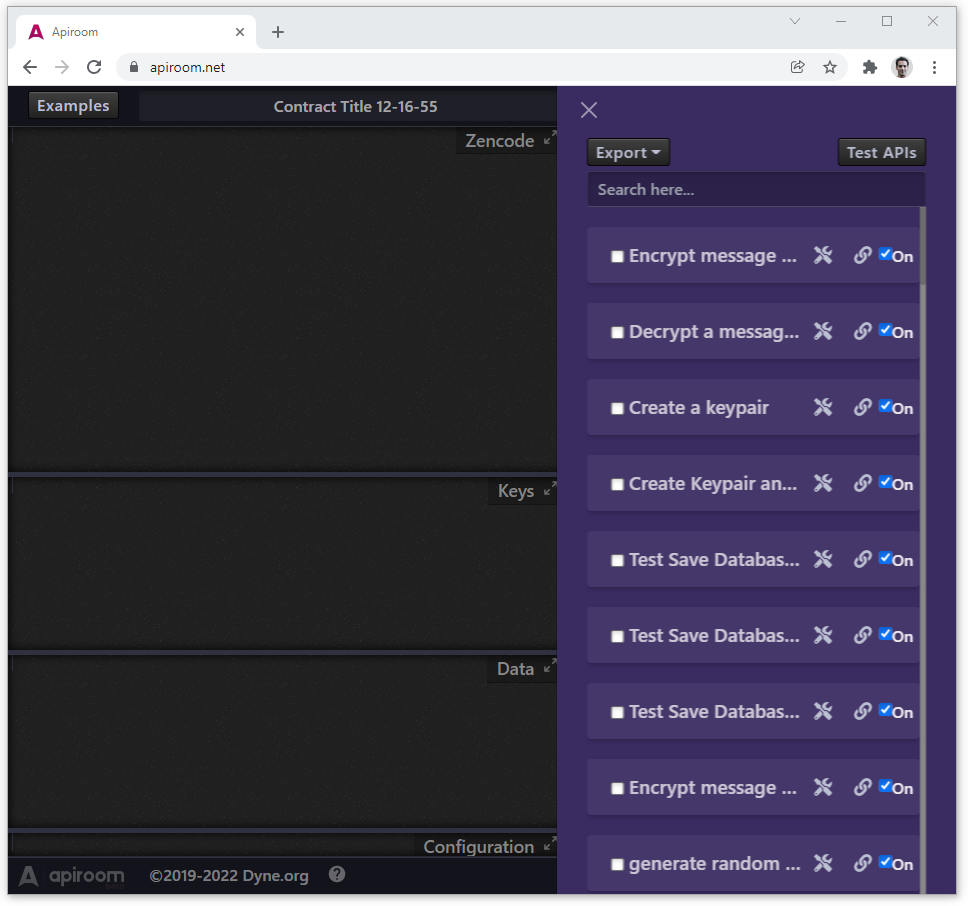


Here we see a list of all your deployed smart contracts. By clicking on it you can open and edit it in the editor. 

In this side pane you also see:

- A **checkbox** next to the name, that you can use to **Export** one or more smart contracts (more on this below)
- The toolbox ⚒️ button, this will allow you to **Clone**, **Rename** or **Delete** the smart contract
- The link 🔗 button, this will open the endpoint of the API 
- An **On/Off** checkbox: this turns on and off the API. When turn-ed off, the API will not be deployed (nor you can test it in Swagger (more on this below), you can turn it back on at a later point.

In the top of this pane you see the buttons: 
- **Export**: it exports the ticked smart contracts and builds a *Dockerfile* along with the software needed to run them, so you can deploy your service wherever you want (currently in beta).
- **Test APIs**: this will bring to a [Swagger](https://swagger.io/) instance, where you can test and debug your APIs.

**IMPORTANT**: take a mental note of the smart contract **Encrypt message with password** as we'll be giving a deeper look at it in a minute. That comes straight from the smart contract **Encrypt a message using a password** from the examples of the front-end editor. 


## IMPORTANT (I): Difference between *Keys* and *Data* in a deployed smart contract

This is a very **important** point, so pay attention: the Data you saved in the front-end editor is stored here for reference only and ***will not be loaded as the smart-contract is exposed to an API in Restroom-mw*** (more about this in a minute). 
On the other hand, what you store in **Keys** will be read at each execution. This implies two important things:

* If you saved something into **Data** that the smart contract needs to run, **the API will return an error**.
* What you have saved in **Keys** will be sort of *hardcoded* in the API execution. Therefore you typically want to save in **Keys** information that you do no expect to pass to the API via POST, such as keys and some endpoints


## IMPORTANT (II): running smart contract that use the Restroom-mw statements

Zenroom itself is an isolated virtual machine, meaning it has no access too the file system or the network.
[Restroom-mw](https://dyne.github.io/restroom-mw/#/) extends Zenroom's capabilities by introducing Zencode statements that let the smart contract interact with the outside world, doing things like querying an API, passing Zenroom's output to an API, storing data on a database or a blockchain. This features comes with an important caveat:

* The smart contracts using **Restroom-mw** extensions, will only read data passed in **Keys** also when running the smart contract in the front-end (by pressing the **Run▶️** button. 

In order to use **Restroom-mw** statements, the smart contract needs to have in its beginning the enabling statement :

	Rule caller restroom-mw

All the examples in the group **[R]Restroom-mw** will have this statement on top. For this reason, all these examples are only using the **Keys** field: we took this precaution to make your life easier, but keep in mind that you want to have control over what you store in **Keys** (which will be "hardcoded") or in **Data** (which you expect to pass to the API via POST).


# Testing and debugging an API

If you press the **Test APIs** button in the top right of the APIs pane, you land on something like this: 

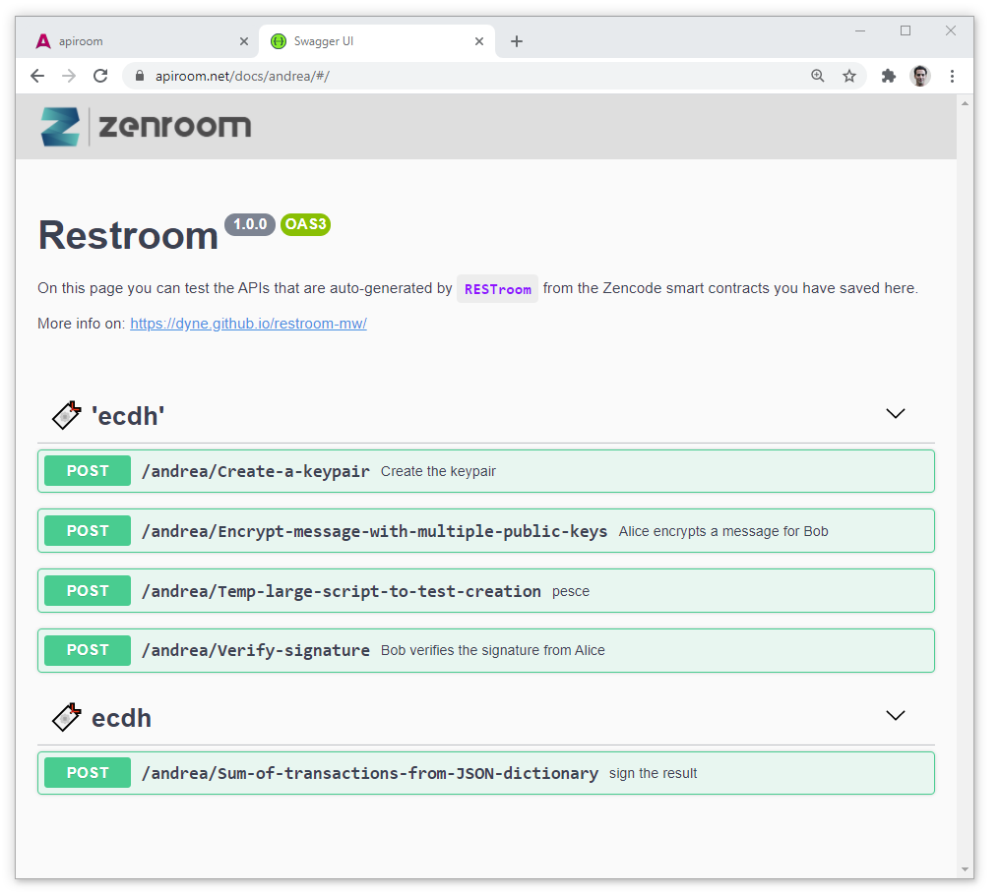

Let's have a look at the API *Encrypt-message-with-password*: this exposes a smart contract that performs symetric encryption from a string, loaded from the examples in front-end editor. The smart contracts requires several strings to run, of which only one (the password) is saved in the **Keys** field. If you execute it from the **Link** in Apiroom's backend, you would get the error:

```bash
ZEN:run() [!] /zencode.lua:285: Given that I have a 'string' named 'header' [!] Error detected. Execution aborted.
```

The reason is, the smart contract is missing a string (it is actually missing two in total) which we need to pass to the API. This where Swagger comes to help, if you click on the ***/dyneorg/Encrypt-message-with-password*** smart contract link in Swagger, and below you press the ***Try it out*** you are presented with something like this: 


What you want to do now, is
- Fill the **data** in text box with the strings that the smart contract is expecting, in JSON, which you can again check in the **Encrypt a message using a password** example in the front-end editor, so with: 

```json
{
	"header": "A very important secret",
	"message": "Dear Bob, your name is too short, goodbye - Alice."
}
```

- Leave the **keys** part empty, because the content of that will be read by the keys stored in the Apiroom's back-end.

The result should look like this (don't mind the formatting, as long as it's JSON it will work): 

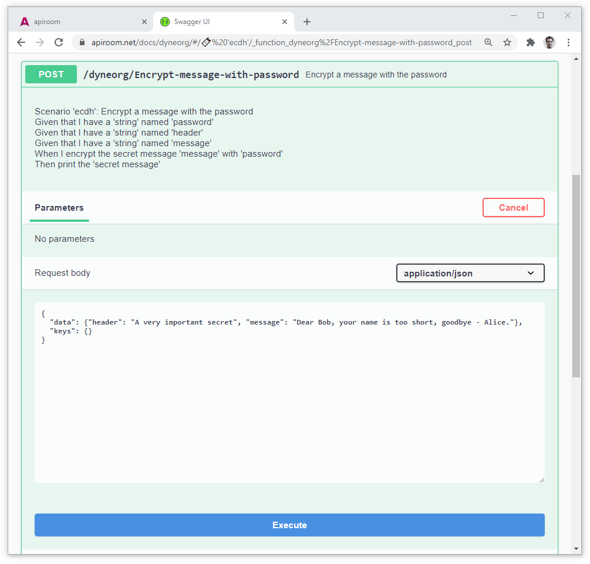

When you press the **Execute button**, you should be getting the result of the smart-contract (some cryptographic material, in the *Response body* ) along with some other interesting stuff that we see below:

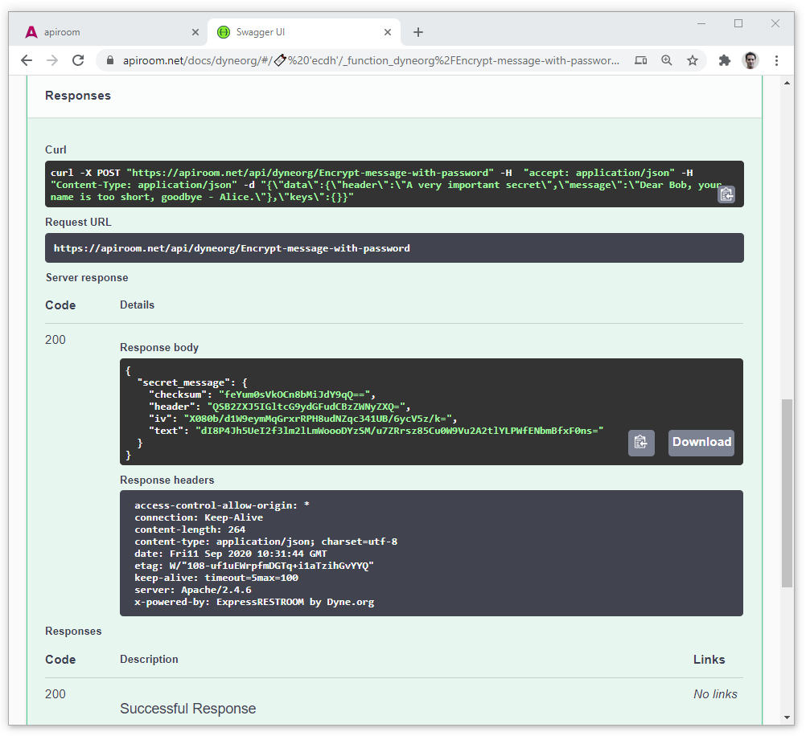


## CURL 

Swagger provides you with a *curl* shell script to test the API from a command line, which you can do straight ahead (it works on Windows too!):

```bash
curl -X POST "https://apiroom.net/api/dyneorg/Encrypt-message-with-password" -H  "accept: application/json" -H  "Content-Type: application/json" -d "{\"data\":{\"header\":\"A very important secret\",\"message\":\"Dear Bob, your name is too short, goodbye - Alice.\"},\"keys\":{}}"
```

The result should be some crypto-material, similar to the one you saw in the *Response body*


## CURL with a file

You may also want to use the *curl* script, but instead of passing the data inline in the script, you may want to upload it from a file: you'll simply need to properly encapsulated the **data** in a json file and use the right *curl* parameter to upload the file. 

The file should look like this: 

[](./ApiroomDemoData.json ':include :type=code json')

and the *curl* script should use the the parameter **-d "@./pathOf/myFile.json"**, looking like:

```bash
curl "https://apiroom.net/api/dyneorg/Encrypt-message-with-password" -H "accept: application/json" -H "Content-Type: application/json" -d "@./data.json"
```

## Prototyping your microservice

If you master *curl* and some shell scripting, you will easily be able to create a service that pulls data from somewhere, encapsulates it in a file and then uploads to your favourite *smart-contract turned API* for some super-rapid micro-service prototyping.

You can obviously also use the APIs exposed in Apiroom in your web/mobile application, by using the **POST** call that we have just tested in *curl* 


# Export APIs 

After you're happy with the APIs you've prototyped and you're ready for a real deployment, in the back-end of Apiroom you can **select some smart contracts and export them** to:

- A **Dockerfile** 
- A shell script that will **install Restroom-mw and the APIs**
- Just download **smart contracts**, which you can use in Zenroom or Restroom-mw, along with the keys and data you have saved
 

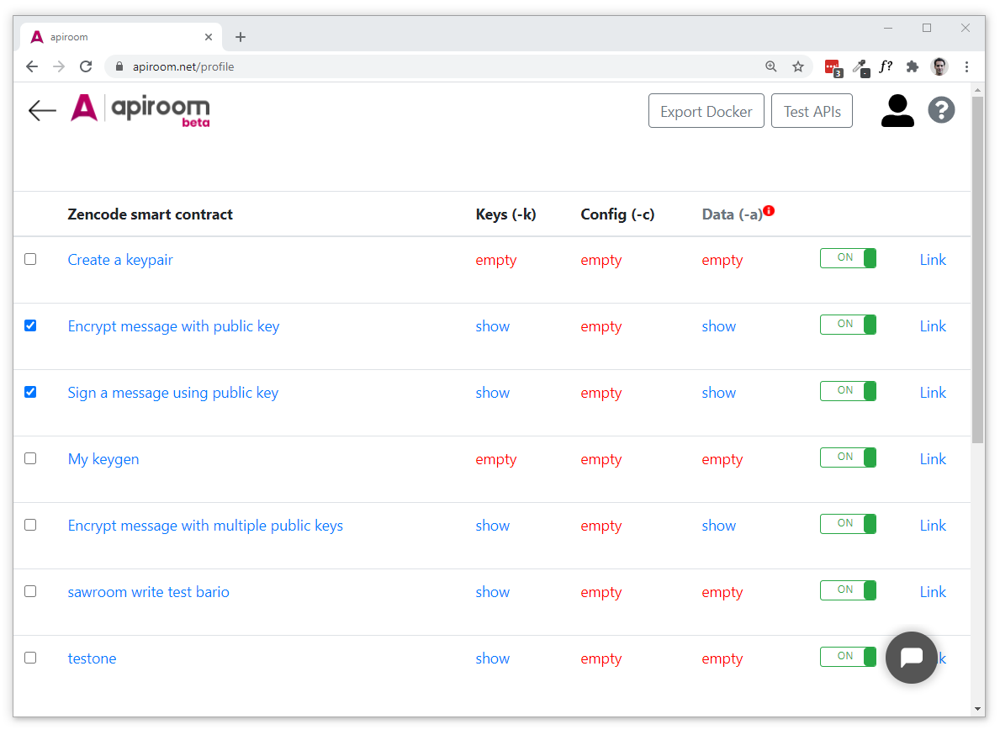

## Export APIs to Dockerfile

You can export your APIs to a **Dockerfile** that will:
 
 - Create a Docker image 
 - Clone and configure [Restroom-mw](https://dyne.github.io/restroom-mw/#/) 
 - Save there the contracts that you have selected 

To create the **Dockerfile**, select the contracts you want have running in the microservice then clic on "Export Docker"


### Docker image configuration

The **Dockerfile** contains the:
 - The ports used by the Docker image 
 - The config of [Restroom-mw](https://dyne.github.io/restroom-mw/#/), meaning the ports (which should match with the ports used by the Docker image) and the folder where the contracts and keys/data are saved. Those are stored in the **.env** file inside the **/restroom-mw** folder of the Docker image
 
They are contained in those lines, that can be edited manually: 

```bash
# Configure restroom
ENV ZENCODE_DIR=/restroom-mw/zencode
ENV CUSTOM_404_MESSAGE="nothing to see here"
ENV HTTP_PORT=3300
ENV HTTPS_PORT=3301
ENV OPENAPI=true
```

### Build and run the Docker image 

To build the image you can to use: 

```bash
docker build --tag dyne/restroom_mw:latest .
```

After the image is build, assuming that you're using th in order to run it, you can use:

```bash
docker run -d -p 3300:3300 -p 3301:3301 dyne/restroom_mw:latest
```

If everything worked fine, by going to **http://localhost:3300/docs** you should see something like this:


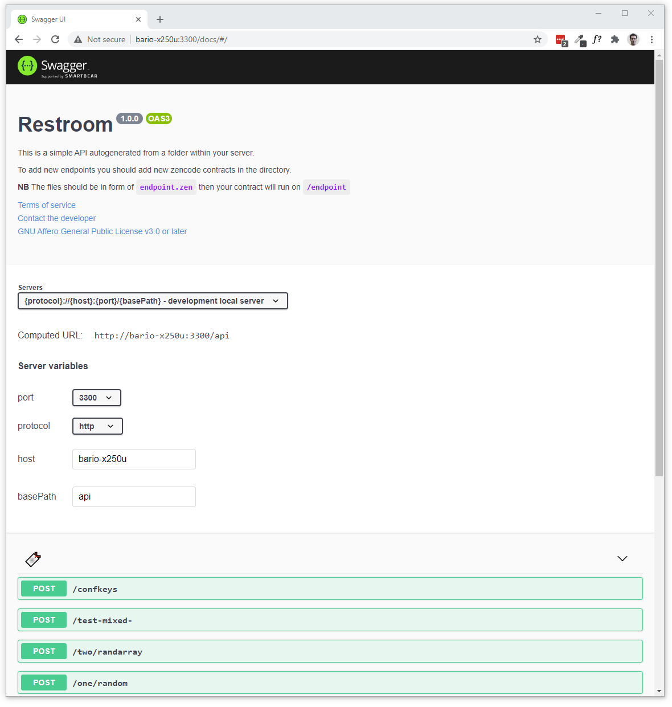

## Export APIs to a Restroom-mw instance

If you select the Export -> **script to setup...**, Apiroom will generate a shell script, that will:

- Install **Restroom-mw**
- Copy a default **.env file** in the Restroom-mw instance
- Copy the **smart contracts/APIs** in the Restroom-mw instance
- Give you instructions on **how to build and launch** Restroom-mw 

You want to use this option if you want to have the APIs on a non-containerized server. 


<!-- WIP 

## TEMP
 
We've done this already: let's start with create a file named *myLargeNestedObjectWhen.json*. This file contains everything we need for every part of this chapter and - along  with the *Given* part of the script, you can use this JSON to later make your own experiments with Zencode.

[](../_media/examples/zencode_cookbook/myLargeNestedObjectWhen.json ':include :type=code json')


[](../_media/examples/zencode_cookbook/whenCompleteScriptGiven.zen ':include :type=code gherkin')
 
-->
