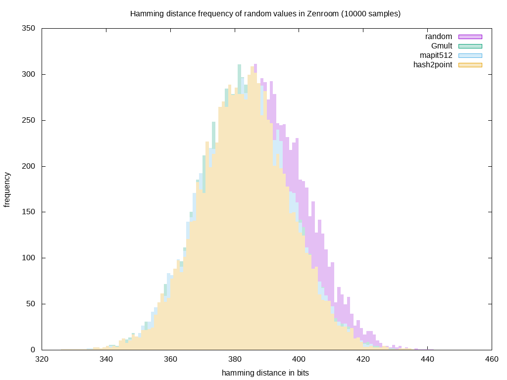

# Random quality measurements

Obviously, randomness is very important when doing cryptography.

Zenroom accepts a random seed when called or retrieves one
automatically from the host system.

**Zenroom is fully deterministic**: if the same random seed is
provided then all results of transformations will be exactly the same,
except for the sorting order of elements in its output, which must be
sorted by the caller with a constant algorithm.

If the random seed is not provided at call time, then Zenroom does its
best to gather a good quality random seed from the host system. This
works well on Windows, OSX, GNU/Linux as well Android and iOS; but
beware that **when running in Javascript random is very weak**.

## Measure your system

To have a value estimation on the system you are currently running
Zenroom, run the LUA command `BENCH.entropy()` and compare these
results:

```
 .  Benchmark: entropy of random generators (Shannon ratios)
SEED: 	 0.9772232
PRNG: 	 0.9737687
OCTET: 	 0.9880916
BIG:   	 0.9885069
ECP:   	 0.9880916
ECP2:  	 0.9810042
```

The `SEED` value is the one gathered from the underlying system or
passed by the host application calling Zenroom.

The `PRNG` is the value yield by the "pseudo" random generator which
is processing the SEED to produce a deterministic series of random
values based on it.

Given 1.0 is the ideal maximum for entropy, all values yield on your
system should be close to the ones above, indicating a sane amount of
entropy for cryptographic operations and in particular key generation.

### FIPS140-2 compliancy

Zenroom can be proven to comply with the [Federal Information
Processing Standard (FIPS) Publication
140-2](https://en.wikipedia.org/wiki/FIPS_140-2) launching the
`./test/random_rngtest_fips140-2.sh` test on a system where
`rng-tools` are installed.

This script will feed 1000 blocks, each consisting of 2500 bytes long
random sequences and print the results given by the test program
`rngtest`.

## Pseudo-random generator

In order to generate key material, it is often needed to have a random
number generator (RNG). But generating good randomness (one which is
unpredictable to attackers) is very challenging for a variety of reasons.
An alternative to use RNG is to use Pseudo Random Generators (PRNG), which
pseudo random data is generated from a seed by a deterministic algorithm.
It is often the case as well that the seed for this PRNG is actual real
random data.

In the context of a cryptographic system, this pseudo random data should not
give information of any past nor future outputs from the PRNG. This is
difficult to prevent as an attacker at some point might be able to acquire
the internal state of a PRNG, which can lead to they being able to
follow all of the outputs of the internal state of the generator. Once
the PRNG internal state is compromised is difficult to recover it a
secure state again.

Cryptographic strength is added to any random seed by Zenroom's
pseudo-random generator (PRNG) which is an [old RSA
standard](ftp://ftp.rsasecurity.com/pub/pdfs/bull-1.pdf) basically
consisting of:

```txt
Unguessable seed -> SHA -> PRNG internal state -> SHA -> random numbers
```
-----

## Hamming distance frequency

As a reference indicator of results here we provide a graph that shows
the [Hamming distance](https://en.wikipedia.org/wiki/Hamming_distance)
measuring how many different bits are there between each new random
776 bit long octets. This benchmark was run on a PC gathering entropy
from system events:



Here are represented four different random generation methods which
are commonly used in cryptographic transformations. It is noticeable
that the most common average distance is **between 380 and 400 bits**
for all of them.
