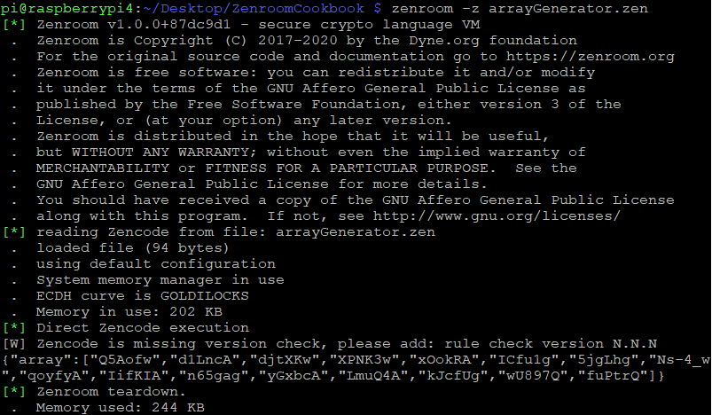

# Quickstart: My first random array :id=quickstart

One of Zenroom's strong points is the quality of the random generation (see [random test 1](https://github.com/dyne/Zenroom/blob/master/test/random_hamming_gnuplot.sh) and [random test 2](https://github.com/dyne/Zenroom/blob/master/test/random_rngtest_fips140-2.sh)), which happens to pass NIST's [tests](https://github.com/dyne/Zenroom/blob/master/test/nist/run.sh), so let's start with generate an array of random numbers and get it printed out. 

Let's first go the super fast way to test code, entering the [Zenroom web playground](https://apiroom.net). Copy this code into the *Zencode* tab on the top left of the page: 


[](../_media/examples/zencode_cookbook/cookbook_intro/randomArrayGeneration.zen ':include :type=code gherkin')


Then press the *PLAY▶️* button to execute the script, the result should look like this:


We got a nice array here. You can play with the values *'16'* and *'32'*, to see both the array and the random numbers change their length. 

# Use Zenroom by command line (CLI) 

Once you're done with your array, it's time to go pro, meaning that we're leaving the web demo and moving to using Zenroom as *command line application* (CLI). 

 - The first step is to download a version of Zenroom that works on your system from the [Zenroom downloads](https://zenroom.org/#downloads). 
 - If you're using Linux, you'll want to place Zenroom in `/bin` or `/usr/sbin` (or just create a symlink or an alias).
 - Third, fire up your favourite text editor, paste the smart contract in it and save it *arrayGenerator.zen*

Now you can let zenroom execute the script by launching the command:

```
zenroom -z arrayGenerator.zen 
```

The result will look like this: 



In the example Zenroom did graciously output first the licensing, then some information about the file and the execution setting, a warning, our array and finally a message stating the it correctly shutdown after using a certain amount of RAM...a lot of information: how do I get my array saved into a file that I can later use? 

On Linux, you can use: 

```bash
zenroom -z arrayGenerator.zen | tee myFirstRandomArray.json
```

After running this command, a file named *myFirstRandomArray.json* should have magically appeared in the folder you're in, looking like <a href="./_media/examples/zencode_cookbook/cookbook_intro/myFirstRandomArray.json" download>this one</a>.

# Renaming the array: the *And* keyword

Open *myArray.json* with your text editor, and notice that the array produced with our first script is named "array": that is Zenroom's behaviour when creating objects. But what if that array should be called something else? First you will need to learn two concepts: 
 - All data manipulation has to occur in the *When* phase.
 - Each phase can have as many commands as you like, provided that they're on a different line and they begin with the keyword *And* 
For example, you can rename your array to *'myArray'* by running this script:

[](../_media/examples/zencode_cookbook/cookbook_intro/randomArrayRename.zen ':include :type=code gherkin')

Note that you need to use the **' '** in the line that renames the array, cause you may be generating and renaming a bunch of arrays already, like in this script:

[](../_media/examples/zencode_cookbook/cookbook_intro/randomArrayMultiple.zen ':include :type=code gherkin')


The script above will produce an output like this: 


[](../_media/examples/zencode_cookbook/cookbook_intro/myArrays.json ':include :type=code json')


Certainly, at this point, your keen eye has noted something odd in the output...If in the Zencode I generated the arrays sorted by size, why is output sorted differently? Because in Zenroom, my friend,  [Determinism](https://github.com/dyne/Zenroom/blob/master/test/deterministic_random_test.sh) is king, so Zenroom will by default sort the output alphabetically.

If you enjoyed the trip so far, go on and learn how to program Zencode starting by the [Given](/pages/zencode-cookbook-given) phase.
