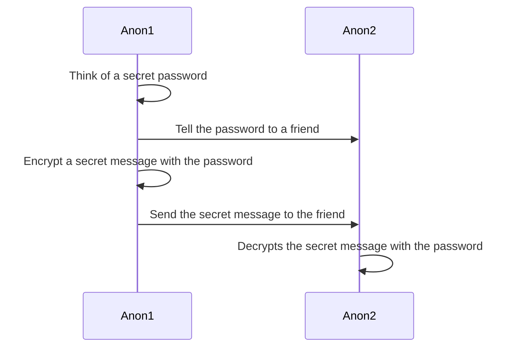
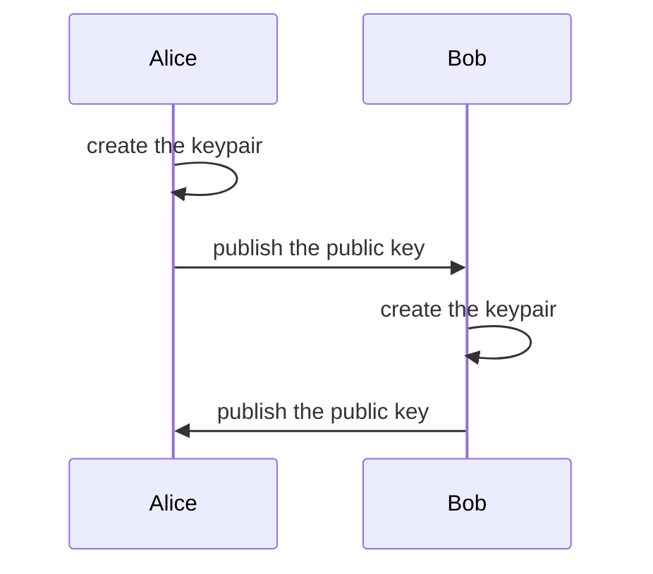
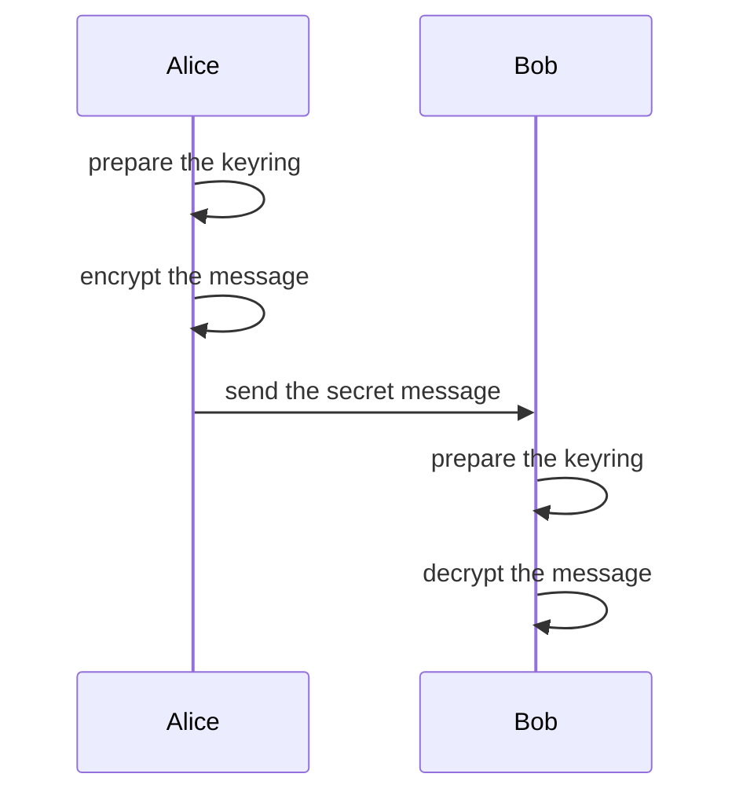
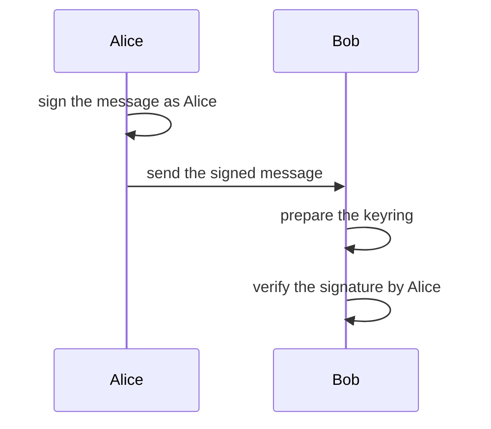

# Symmetric cryptography

This is a simple technique to hide a secret using a common password known to all participants.

The algorithm used is
[AES-GCM](https://en.wikipedia.org/wiki/Galois/Counter_Mode) with a random IV and an optional authenticated header ([AEAD](https://en.wikipedia.org/wiki/Authenticated_encryption))


<!-- Old stuff

[](../_media/examples/zencode_simple/SYM02.zen ':include :type=code gherkin')

The output is returned in `secret message` and it looks like:

[](../_media/examples/zencode_simple/cipher_message.json ':include :type=code json')

To decode make sure to have that secret password and that a valid `secret message` is given, then use:

[](../_media/examples/zencode_simple/SYM03.zen ':include :type=code gherkin')

-->

So let's imagine I want to share a secret with someone and send secret messages encrypted with it:



The encryption is applied using 3 arguments:

- `password` can be any string (or file) used to lock and unlock the secret
- `message` can be any string (or file) to be encrypted and decrypted
- `header` is a fixed name and optional argument to indicate an authenticated header

These 3 arguments can be written or imported, but must given before using the `I encrypt` statement, explained in [scenario 'ecdh' manual](/pages/zencode-scenarios-ecdh?id=symetric-cryptography-encrypt-with-password).


Of course the password must be known by all participants and that's the dangerous part, since it could be stolen. We mitigate this risk using **public-key cryptography**, also known as **a-symmetric encryption**, explained below.


# Asymmetric cryptography

We use [asymmetric encryption (or public key
cryptography)](https://en.wikipedia.org/wiki/Public-key_cryptography)
when we want to introduce the possession of **keypairs** (public and private) both by
Alice and Bob: this way there is no need for a single secret to be known to both.

Fortunately it is pretty simple to do using Zencode in 2 steps

- Key generation and exchange ([SETUP](https://en.wikipedia.org/wiki/Key_exchange))
- Public-key Encryption or signature ([ECDH](https://en.wikipedia.org/wiki/Elliptic-curve_Diffie%E2%80%93Hellman) and [ECDSA](https://en.wikipedia.org/wiki/Elliptic_Curve_Digital_Signature_Algorithm))

## Key generation and exchange

In this phase each participant will create his/her own keypair, store it and communicate the public key to the other. First the private key will be generated from from a random number, and then public key, which is usually a longer octet and actually an [Elliptic Curve Point](/lua/modules/ECP.html) coordinate.

<!-- Old stuff

The statement to generate a keypair (public and private keys) is simple:

[](../_media/examples/zencode_simple/alice_keygen.zen ':include :type=code gherkin')

It will produce something like this:

[](../_media/examples/zencode_simple/alice_keypair.json ':include :type=code json')

There is nothing preventing an host application to separate these JSON
fields and store them in any secure way.

-->

Here we demonstrate how to create keypairs as well separate them using Zencode:

- 2 contracts to create Alice and Bob keypairs
- 2 contracts to separate the public key from the private key for each

After both Alice and Bob have their own keypairs and they both know each other public key we can move forward to do asymmetric encryption and signatures.




One of the advantage of using Zencode here is the use of the `valid` keyword which effectively parses the `public key` object and verifies it as valid, in this case as being a valid point on the elliptic curve in use. This greatly reduces the possibility of common mistakes.

They keypair generation is detailed in [scenario 'ecdh' manual](/pages/zencode-scenarios-ecdh?id=generate-a-keypair).


## Public-key Encryption (ECDH)

Public key encryption is similar to the asymmetric encryption explained in the previous section, with a difference: the `from` and `for` clauses indicating the public
key of the recipient.

Before getting to the encryption 2 other objects must be given:

- `keypair` is one's own public and private keys
- `public key` from the intended recipient

<!-- Old stuff

So with an input separated between DATA and KEYS or grouped together in an array like:

[](../_media/examples/zencode_simple/bob_keyring.json ':include :type=code json')

[](../_media/examples/zencode_simple/AES05.zen ':include :type=code gherkin')

which encrypts and stores results in `secret message`; also in this case `header` may be given, then is included in the encryption as an authenticated clear-text section.

-->




The decryption will always check that the header hasn't changed, maintaining the integrity of the string which may contain important public information that accompany the secret.

They asymetric encryption is detailed in [scenario 'ecdh' manual](/pages/zencode-scenarios-ecdh?id=encrypt-a-message-with-a-public-key).


## Public-key Signature (ECDSA)

Public-key signing allows to verify the integrity of a message by
knowing the public key of all those who have signed it.

It is very useful when in need of authenticating documents: any change
to the content of a document, even one single bit, will make the
verification fail, showing that something has been tampered with.

The one signing only needs his/her own keypair, so the key setup will
be made by the lines:

```gherkin
	Given that I am known as 'Alice'
	and I have my valid 'keypair'
```

then assuming that the document to sign is in `draft`, Alice can
proceed signing it with:

```gherkin
	and I create the signature of 'draft'
```

which will produce a new object `signature` to be printed along the
draft: the original message stays intact and the signature is detached.

On the other side Bob will need Alice's public key to verify the
signature with the line:

```gherkin
	When I verify the 'draft' is signed by 'Alice'
```

which will fail in case the signature is invalid or the document has
been tampered with.




They asymetric encryption is detailed in [scenario 'ecdh' manual](/pages/zencode-scenarios-ecdh?id=create-the-signature-of-an-object): there we have an example where Alice uses her private key to sign and authenticate a message. Bob or anyone else can use Alice's public key to prove that the integrity of the message is kept intact and that she signed it.

# Zero Knowledge Proof and Attribute Based Credentials

In this chapter we'll look at some more advanced cryptography, namely the 'Attribute Based Credentials' and the 'Zero Knowledge Proof': this is powerful and complex feature
implemented using the [Coconut crypto scheme](https://arxiv.org/pdf/1802.07344.pdf). 

Zencode supports several features based on pairing elliptic curve
arithmetics and in particular:

- non-interactive zero knowledge proofs (also known as ZKP or ZK-Snarks)
- threshold credentials with multiple decentralised issuers
- homomorphic encryption for numeric counters

These are all very useful features for architectures based on the
decentralisation of trust, typical of **DLT and blockchain based
systems, as well for off-line and non-interactive authentication**.

The Zencode language leverages two main scenarios, more will be
implemented in the future.

1. Attribute Based Credentials (ABC) where issuer verification keys
   represent specific credentials
2. A Petition system based on ABC and homomorphic encryption

Three more are in the work and they are:

1. Anonymous proxy validation scheme
2. Token thumbler to privately transfer numeric assets
3. Private credential revocation

**Zero knowledge proof** and **attribute based credential** cryptography are detailed in [scenario 'credential' manual](/pages/zencode-scenario-credentials)


# DP3T: Proximity Tracing


Following up [this popular post on how to make decentralized privacy-preserving proximity tracing using zencode](https://medium.com/@jaromil/decentralized-privacy-preserving-proximity-tracing-cryptography-made-easy-af0a6ae48640) this documentation will go through implementation details.

The Decentralized Privacy-Preserving Proximity Tracing (DP-3T) protocol is described in the [DP-3T Whitepaper](https://github.com/DP-3T/documents/).

If you are a mobile app developer or a tech-savvy person in general, someone that can read and experiment with a shell script or javascript or someone curious enough to know more how applied cryptography works, then read on and you’ll be surprised how easy this is.


The scenario **dp3t** is detailed in the [scenario 'dp3t' manual](/pages/zencode-scenario-dp3t).
