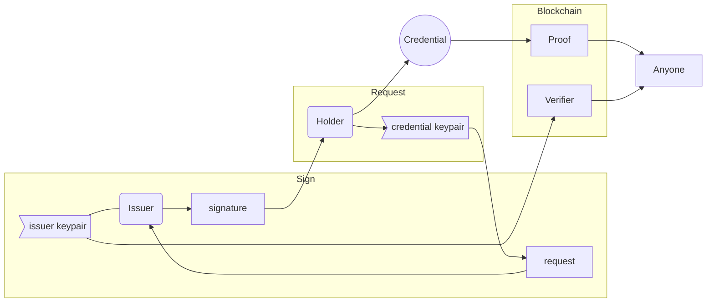
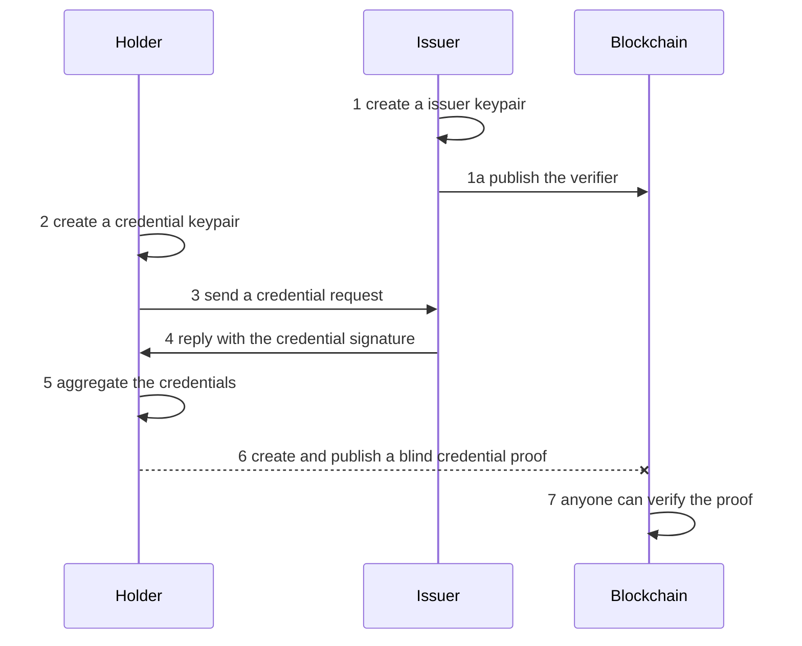

# Scenario 'credentials': Zero knowledge Proof and Attribute Based Credentials

 

Let's imagine 3 different subjects for our scenarios:

1. **Mad Hatter** is a well known **credential issuer** in Wonderland
2. **Wonderland** is an open space (a blockchain!) and all inhabitants can check the validity of **proofs**
3. **Alice** just arrived: to create **proofs** she'll request a **credential** to the issuer **MadHatter**

When **Alice** is in possession of **credentials** then she can
create a **proof** any time she wants using as input:

- the **credentials**
- her **credential keypair**
- the **verifier** by MadHatter
[](../_media/examples/zencode_simple/create_proof.zen ':include :type=code gherkin')

All these "things" (credentials, proofs, etc.) are data structures that can be used as input and received as output of Zencode functions. For instance a **proof** can be print in **JSON** format and looks a bit list this:

```json
{
   "credential_proof" : {
      "pi_v" : {
         "c" : "u64:tBrCGawWYEAi55_hHIPq0JT3OaapOebSHVW0GhjJcAk",
         "rr" : "u64:J7R3FXsI2dcfyZRCqWA8fDYijG39P16LvGpX90wtCWw",
         "rm" : "u64:QoG-28CNTAY3Ir4SQqVoK1ZpTlzOnXxX6Xtq5KMIxpo"
      },
      "nu" : "u64:BA77WYvBRsc53uAyrqTjuUdptJPZbcTlzr9icizm0...",
      "sigma_prime" : {
         "h_prime" : "u64:BB9AM5xjWPxsZ47zh1WAmFymru66W6YuK...",
         "s_prime" : "u64:BAGYNM6JO0wRAGE87_-bQVuhUXeEoeJrh..."
      },
      "kappa" : "u64:GFVYsudbHOJNzPl3ZL0_VzB_DRvrPKF26OCZR9..."
   },
   "zenroom" : {
      "scenario" : "coconut", "encoding" : "url64", "version" : "1.0.0"
   }
}
```

Anyone can verify proofs using as input:

- the **credential proof**
- the **verifier** by MadHatter
[](../_media/examples/zencode_simple/verify_proof.zen ':include :type=code gherkin')

What is so special about these proofs? Well!  Alice cannot be followed
by her trail of proofs: **she can produce an infinite number of
proofs, always different from one another**, for anyone to recognise
the credential without even knowing who she is.


Imagine that once **Alice** is holding **credentials** she can enter
any room in Wonderland and drop a **proof** in the chest at its
entrance: this proof can be verified by anyone without disclosing
Alice's identity.

The flow described above is pretty simple, but the steps to setup the
**credential** are a bit more complex. Lets start using real names
from now on:

- Alice is a credential **Holder**
- MadHatter is a credential **Issuer**
- Wonderland is a public **Blockchain**
- Anyone is any peer connected to the blockchain



---- 

To add more detail, the sequence is:



## The 'Coconut' credential flow in Zenroom


1 **MadHatter** generates an **issuer keypair**

***Input:*** none

***Smart contract:*** credentialIssuerKeygen.zen

[](../_media/examples/zencode_cookbook/credentialIssuerKeygen.zen ':include :type=code gherkin')


***Output:*** credentialIssuerKeypair.json

[](../_media/examples/zencode_cookbook/credentialIssuerKeypair.json ':include :type=code json')

----

1a **MadHatter** publishes the **verification key**

***Input:*** credentialIssuerKeypair.json

***Smart contract:*** credentialIssuerPublishVerifier.zen

[](../_media/examples/zencode_cookbook/credentialIssuerPublishVerifier.zen ':include :type=code gherkin')

***Output:*** credentialIssuerVerifier.json

[](../_media/examples/zencode_cookbook/credentialIssuerVerifier.json ':include :type=code json')


----

2 **Alice** generates her **credential key**

***Input:*** none

***Smart contract:*** credentialParticipantKeygen.zen

[](../_media/examples/zencode_cookbook/credentialParticipantKeygen.zen ':include :type=code gherkin')


***Output:*** credentialParticipantKeypair.json

[](../_media/examples/zencode_cookbook/credentialParticipantKeypair.json ':include :type=code json')

You can also generate the key elsewhere and then import it into Zenroom. To do that you can use one of the following statements:

```gherkin
When I create the credential key with secret key 'myKey'
When I create the credential key with secret 'myKey'
```
where **myKey** is the credential key generated outside of Zenroom.

----

3 **Alice** sends her **credential signature request**

***Input:*** credentialParticipantKeypair.json 

***Smart contract:*** credentialParticipantSignatureRequest.zen

[](../_media/examples/zencode_cookbook/credentialParticipantSignatureRequest.zen ':include :type=code gherkin')


***Output:*** credentialParticipantSignatureRequest.json

[](../_media/examples/zencode_cookbook/credentialParticipantSignatureRequest.json ':include :type=code json')

----

4 **MadHatter** decides to sign a **credential signature request**

***Input:*** credentialParticipantSignatureRequest.json ***and*** credentialIssuerKeypair.json 

***Smart contract:*** credentialIssuerSignRequest.zen

[](../_media/examples/zencode_cookbook/credentialIssuerSignRequest.zen ':include :type=code gherkin')


***Output:*** credentialIssuerSignedCredential.json

[](../_media/examples/zencode_cookbook/credentialIssuerSignedCredential.json ':include :type=code json')

----

5 **Alice** receives and aggregates the signed **credential**

***Input:*** credentialIssuerSignedCredential.json ***and*** credentialParticipantKeypair.json

***Smart contract:*** credentialParticipantAggregateCredential.zen

[](../_media/examples/zencode_cookbook/credentialParticipantAggregateCredential.zen ':include :type=code gherkin')


***Output:*** credentialParticipantAggregatedCredential.json

[](../_media/examples/zencode_cookbook/credentialParticipantAggregatedCredential.json ':include :type=code json')

----

6 **Alice** produces an anonymized version of the **credential** called **proof**

***Input:*** credentialParticipantAggregatedCredential.json ***and*** credentialIssuerVerifier.json 

***Smart contract:*** credentialParticipantCreateProof.zen

[](../_media/examples/zencode_cookbook/credentialParticipantCreateProof.zen ':include :type=code gherkin')

***Output:*** credentialParticipantProof.json

[](../_media/examples/zencode_cookbook/credentialParticipantProof.json ':include :type=code json')

----

7 **Anybody** matches Alice's **proof** to the MadHatter's **verifier**

***Input:***  credentialParticipantAggregatedCredential.json ***and*** credentialIssuerVerifier.json 

***Smart contract:*** credentialAnyoneVerifyProof.zen

[](../_media/examples/zencode_cookbook/credentialAnyoneVerifyProof.zen ':include :type=code gherkin')

***Output:*** "Success" or else Zenroom throws an error


## Centralized credential issuance

Lets see how flexible is Zencode.

The flow described above is for a fully decentralized issuance of
**credentials** where only the **Holder** is in possession of the
**credential keypair** needed to produce a **credential proof**.

But let's imagine a much more simple use-case for a more centralized
system where the **Issuer** provides the **Holder** with everything
ready to go to produce zero knowledge credential proofs.

The implementation is very, very simple: just line up all the **When**
blocks where the different operations are done at different times and
print the results all together!

```gherkin
Scenario credential
	Given that I am known as 'Issuer'
	When I create the issuer keypair
	and I create the credential keypair
	and I create the credential request
	and I create the credential signature
	and I create the credentials
	Then print the 'credentials'
	and print the 'credential keypair'
```

This will produce **credentials** that anyone can take and run. Just
beware that in this simplified version of ABC the **Issuer** may
maliciously keep the **credential keypair** and impersonate the
**Holder**.

# The script used to create the material in this page

All the smart contracts and the data you see in this page are generated by the script [run.sh](https://github.com/dyne/Zenroom/blob/master/test/zencode_credential/run.sh). If you need to setup credentials for other flows (such as *petition* and *reflow*), you can use the script  that creates multiple participants at once [setup_multi_credentials.sh](https://github.com/dyne/Zenroom/blob/master/test/zencode_credential/setup_multi_credentials.sh)

If you want to run the script (on Linux) you should: 
 - *git clone https://github.com/dyne/Zenroom.git*
 - install **zsh** and **jq**
 - download a [zenroom binary](https://zenroom.org/#downloads) and place it */bin* or */usr/bin* or in *./Zenroom/src*

