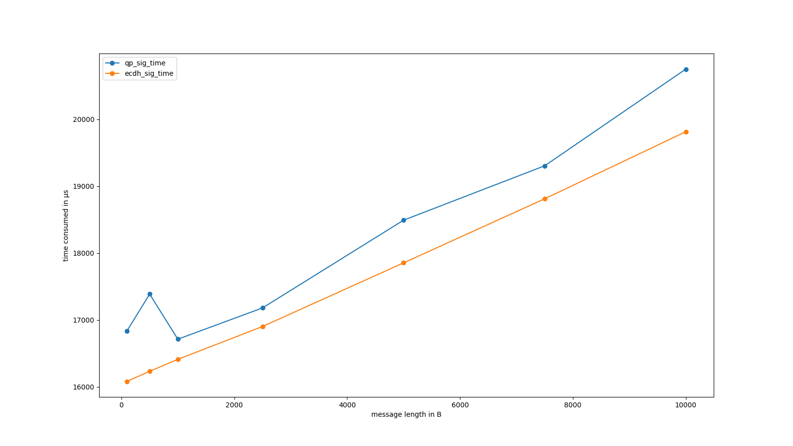
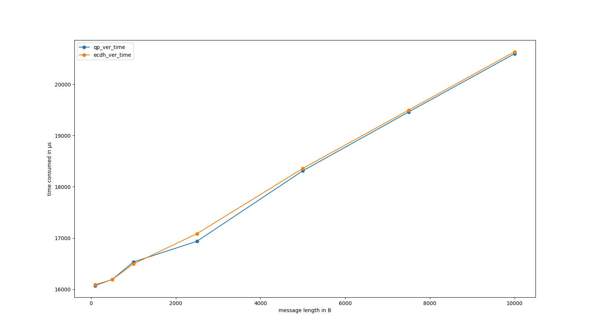

# Post-Quantum cryptography

The QP stands for [Post-Quantum](https://en.wikipedia.org/wiki/Post-quantum_cryptography) cryptography. The need for these cryptographic primitives is due to the threat posed by quantum computers, in particular from the [Schor's algorithm](https://en.wikipedia.org/wiki/Shor%27s_algorithm) and the [Grover's algorithm](https://en.wikipedia.org/wiki/Grover%27s_algorithm), to the modern cryptography. Regarding the symmetric cryptography this attack can be simply avoided by doubling the length of the secret key. On the other hand the situation for the public key cryptography is worst and the only way out is to use new cryptographic schemes resistant to Quantum computer, so we need new Signature and public key schemes.

In Zenroom, using the *Scenario qp*, you will have access to the following Post-Quantum algorithms:
- Signatures:
  - **Dilithium2** from the [NIST PQC Competition](https://csrc.nist.gov/Projects/post-quantum-cryptography/selected-algorithms-2022)
  - **ML-DSA-44** under standardization by NIST in [FIPS-204](https://csrc.nist.gov/pubs/fips/204/final)
- Key Encapsulation Mechanisms: 
  - **Kyber512** from the [NIST PQC Competition](https://csrc.nist.gov/Projects/post-quantum-cryptography/selected-algorithms-2022)
  - **Streamlined NTRU Prime 761** used by [OpenSSH](https://www.openssh.com/txt/release-9.0
  - **ML-KEM-512** under standardization by NIST in [FIPS-203](https://csrc.nist.gov/pubs/fips/203/final)

# Dilithium2

Dilithium2 is a Post-Quantum signature algorithm defined over lattices. From the user side it works as a modern signature scheme:
- **Key generation**: The *signer* create its private and public keys
- **Signature**: The *signer* use its private key to sign a certain message and sent it to the verifier
- **Verification**: The *verifier*, using the *signer* public key, can verify the authenticity of the message

## Key Generation

### Private key

The script below generates a **dilithium** private key.

[](../_media/examples/zencode_cookbook/qp/dilithium/Dilithium_createprivatekey.zen ':include :type=code gherkin')

The output should look like this:

[](../_media/examples/zencode_cookbook/qp/dilithium/Alice_Dilithium_privatekey.keys ':include :type=code json')

### Public key

Once you have created a private key, you can feed it to the following script to generate the **public key**:

[](../_media/examples/zencode_cookbook/qp/dilithium/Dilithium_createpublickey.zen ':include :type=code gherkin')

The output should look like this:

[](../_media/examples/zencode_cookbook/qp/dilithium/Alice_Dilithium_pubkey.json ':include :type=code json')

## Signature

In this example we'll sign three objects: a string, a string array and a string dictionary, that we'll verify in the next script. Along with the data to be signed, we'll need the private key. The private key is in the file we have generate with the first script, while the one with the messages that we will sign is the following:

[](../_media/examples/zencode_cookbook/qp/dilithium/message.json ':include :type=code json')

The script to **sign** these objects look like this:

[](../_media/examples/zencode_cookbook/qp/dilithium/Dilithium_sign.zen ':include :type=code gherkin')

And the output should look like this:

[](../_media/examples/zencode_cookbook/qp/dilithium/Alice_Dilithium_sign.json ':include :type=code json')

You can now merge this file with the one where your dilithium public key is, so that the verifier has everything he needs in one file. You can do it by either use the command:

```bash
jq -s '.[0]*[1]' pubkey.json signature.json | tee data.json
```

where pubkey.json contains the output of the second script and signature.json the output of the above script, or by adding two rows in the previous script, one where you compute the dilithium public key and the other where you print it.


## Verification

In this section we will **verify** the signatures produced in the previous step. As mentioned above what we will need are the signatures, the messages and the signer public key. So the input file should look like:

[](../_media/examples/zencode_cookbook/qp/dilithium/Alice_Dilithium_data.json ':include :type=code json')

The script to verify these signatures is the following:

[](../_media/examples/zencode_cookbook/qp/dilithium/Dilithium_verifysign.zen ':include :type=code gherkin')

The result should look like:

[](../_media/examples/zencode_cookbook/qp/dilithium/Dilithium_verifysign.json ':include :type=code json')

# ML-DSA-44

ML-DSA-44 is a Post-Quantum signature algorithm defined over lattices as an extension of the dilithium algorithm. From the user side it works as a modern signature scheme:
- **Key generation**: The *signer* create its private and public keys
- **Signature**: The *signer* use its private key to sign a certain message and sent it to the verifier
- **Verification**: The *verifier*, using the *signer* public key, can verify the authenticity of the message

## Key Generation

### Private key

The script below generates a **mldsa44** private key.

[](../_media/examples/zencode_cookbook/mldsa44/alice_keygen.zen ':include :type=code gherkin')

The output should look like this:

[](../_media/examples/zencode_cookbook/mldsa44/alice_keys.json ':include :type=code json')

### Public key

Once you have created a private key, you can feed it to the following script to generate the **public key**:

[](../_media/examples/zencode_cookbook/mldsa44/alice_pubkey.zen ':include :type=code gherkin')

The output should look like this:

[](../_media/examples/zencode_cookbook/mldsa44/alice_pubkey.json ':include :type=code json')

## Signature

In this example we'll sign a string that we'll verify in the next script. In this script we create the data to be signed in the code, but it can also be loaded from the extern as we do with the the private key. The private key is in the file we have generate with the first script. The script to **sign** the message look like this:

[](../_media/examples/zencode_cookbook/mldsa44/sign_from_alice.zen ':include :type=code gherkin')

And the output should look like this:

[](../_media/examples/zencode_cookbook/mldsa44/sign_alice_output.json ':include :type=code json')

You can now merge this file with the one where your mldsa44 public key is, so that the verifier has everything he needs in one file. You can do it by either use the command:

```bash
jq -s '.[0]*[1]' pubkey.json signature.json | tee data.json
```

where pubkey.json contains the output of the second script and signature.json the output of the above script, or by adding two rows in the previous script, one where you compute the dilithium public key and the other where you print it.

You can also specify a ctx to use as domain separation in the sign algorithm. For example:

[](../_media/examples/zencode_cookbook/mldsa44/sign_from_alice_ctx.zen ':include :type=code gherkin')

## Verification

In this section we will **verify** the signature produced in the previous step. As mentioned above what we will need is the signature, the message and the signer public key. So the input file should look like:

[](../_media/examples/zencode_cookbook/mldsa44/sign_pubkey.json ':include :type=code json')

The script to verify this signature is the following:

[](../_media/examples/zencode_cookbook/mldsa44/verify_from_alice.zen ':include :type=code gherkin')

If a ctx is used during the sign then you have to use the same for verify. So the input should look like:

[](../_media/examples/zencode_cookbook/mldsa44/sign_pubkey_ctx.json ':include :type=code json')

And the script:

[](../_media/examples/zencode_cookbook/mldsa44/verify_from_alice_ctx.zen ':include :type=code gherkin')

The result should look like:

[](../_media/examples/zencode_cookbook/mldsa44/verify_alice_signature.json ':include :type=code json')


# Kyber512

Kyber512 is a Post-Quantum Key Encapsulation Mechanism defined over lattices. It is a cryptographic primitive that allows anyone in possession of some party’s public key to securely transmit a key to that party. It can be divided in three main part:
- **Key generation**: The *recipient* create its private and public keys
- **Encapsulation**: The *sender*, starting from the recipient public key, generate a 32 byte secret and encapsulate it producing a ciphertext that will be sent to the recipient
- **Decapsulation**: The *recipient* can recreate the secret generated by the *sender* using the received ciphertext and its private key

## Key Generation

### Private key

As above, the script below generates a **kyber** private key.

[](../_media/examples/zencode_cookbook/qp/kyber/Kyber_createprivatekey.zen ':include :type=code gherkin')

The output should look like this:

[](../_media/examples/zencode_cookbook/qp/kyber/Alice_Kyber_privatekey.keys ':include :type=code json')

### Public key

You can now generate the **public key** corresponding to your private key by passing the latter as input to the following script:

[](../_media/examples/zencode_cookbook/qp/kyber/Kyber_createpublickey.zen ':include :type=code gherkin')

The output should look like this:

[](../_media/examples/zencode_cookbook/qp/kyber/Alice_Kyber_pubkey.json ':include :type=code json')

## Encapsulation

The script to generate a secret and encapsulate it is as follow:

[](../_media/examples/zencode_cookbook/qp/kyber/Kyber_enc.zen ':include :type=code gherkin')

And the output should look like this:

[](../_media/examples/zencode_cookbook/qp/kyber/Kyber_Kem.json ':include :type=code json')

Now you have to extract and sent to Alice the ciphertext, you can do it for example using the bash command:

```bash
jq 'del(.kyber_secret)' Kyber_Kem.json | tee Kyber_ciphertext.json
```

and send to Alice the file Kyber_ciphertext.json.

## Decapsulation

In this section we will **decapsulate**, and so reconstruct, the secret produced in the previous step by Bob. To perform this action we will need our private key and the ciphertext produced by Bob as input to the following script:

[](../_media/examples/zencode_cookbook/qp/kyber/Kyber_dec.zen ':include :type=code gherkin')

The result should look like:

[](../_media/examples/zencode_cookbook/qp/kyber/Kyber_secret.json ':include :type=code json')

obviously this secret will be equal to Bob's secret.

# ML-KEM-512

ML-KEM-512 is the Post-Quantum Key Encapsulation Mechanism defined over lattices proposed by NIST. It can be found in https://csrc.nist.gov/pubs/fips/203/final. It is a cryptographic primitive that allows the creation of a shared secret key. It can be divided in three main parts:
- **Key generation**: The *recipient* create its private and public keys
- **Encapsulation**: The *sender*, starting from the recipient public key, generate a 32 byte secret and encapsulate it producing a ciphertext that will be sent to the recipient
- **Decapsulation**: The *recipient* can recreate the secret generated by the *sender* using the received ciphertext and its private key

## Key Generation

### Private key

As above, the script below generates a **mlkem512** private key.

[](../_media/examples/zencode_cookbook/mlkem512/mlkem512_createprivatekey.zen ':include :type=code gherkin')

The output should look like this:

[](../_media/examples/zencode_cookbook/mlkem512/Alice_mlkem512_privatekey.keys ':include :type=code json')

### Public key

You can now generate the **public key** corresponding to your private key by passing the latter as input to the following script:

[](../_media/examples/zencode_cookbook/mlkem512/mlkem512_createpublickey.zen ':include :type=code gherkin')

The output should look like this:

[](../_media/examples/zencode_cookbook/mlkem512/Alice_mlkem512_pubkey.json ':include :type=code json')

## Encapsulation

The script to generate a secret and encapsulate it is as follows:

[](../_media/examples/zencode_cookbook/mlkem512/mlkem512_enc.zen ':include :type=code gherkin')

And the output should look like this:

[](../_media/examples/zencode_cookbook/mlkem512/mlkem512_Kem.json ':include :type=code json')

Now you have to extract and sent to Alice the ciphertext, you can do it for example using the bash command:

```bash
jq 'del(.mlkem512_secret)' mlkem512_Kem.json | tee mlkem512_ciphertext.json
```

and send to Alice the file mlkem512_ciphertext.json.

## Decapsulation

In this section we will **decapsulate**, and so reconstruct, the secret produced in the previous step by Bob. To perform this action we will need our private key and the ciphertext produced by Bob as input to the following script:

[](../_media/examples/zencode_cookbook/mlkem512/mlkem512_dec.zen ':include :type=code gherkin')

The result should look like:

[](../_media/examples/zencode_cookbook/mlkem512/mlkem512_secret.json ':include :type=code json')

obviously this secret will be equal to Bob's secret.


# Streamlined NTRU Prime 761

Streamlined NTRU Prime 761 is a Post-Quantum Key Encapsulation Mechanism defined over lattices. For simplicity in the following it will be called NTRUP. From the user side it works as Kyber:
- **Key generation**: The *recipient* create its private and public keys
- **Encapsulation**: The *sender*, starting from the recipient public key, generate a 32 byte secret and encapsulate it producing a ciphertext that will be sent to the recipient
- **Decapsulation**: The *recipient* can recreate the secret generated by the *sender* using the received ciphertext and its private key

## Key Generation

### Private key

As above, the script below generates a **NTRUP** private key.

[](../_media/examples/zencode_cookbook/qp/ntrup/ntrup_createprivatekey.zen ':include :type=code gherkin')

The output should look like this:

[](../_media/examples/zencode_cookbook/qp/ntrup/Alice_ntrup_privatekey.keys ':include :type=code json')

### Public key

Once you have created a private key, you can create the corresponding **public key** with the following script:

[](../_media/examples/zencode_cookbook/qp/ntrup/ntrup_createpublickey.zen ':include :type=code gherkin')

The output should look like this:

[](../_media/examples/zencode_cookbook/qp/ntrup/Alice_ntrup_pubkey.json ':include :type=code json')

## Encapsulation

The script to generate a secret and encapsulate it took as input the receiver public key and it is as follow:

[](../_media/examples/zencode_cookbook/qp/ntrup/ntrup_enc.zen ':include :type=code gherkin')

The output should look like this:

[](../_media/examples/zencode_cookbook/qp/ntrup/ntrup_Kem.json ':include :type=code json')

Now you have to extract and sent to Alice the ciphertext, you can do it for example using the bash command:

```bash
jq 'del(.ntrup_secret)' ntrup_Kem.json | tee ntrup_ciphertext.json
```

and send to Alice the file ntrup_ciphertext.json.

## Decapsulation

In this section we will **decapsulate**, and so reconstruct, the secret produced in the previous step by Bob. To perform this action we will need our private key and the ciphertext produced by Bob as input to the following script:

[](../_media/examples/zencode_cookbook/qp/ntrup/ntrup_dec.zen ':include :type=code gherkin')

The result should look like:

[](../_media/examples/zencode_cookbook/qp/ntrup/ntrup_secret.json ':include :type=code json')

obviously this secret will be equal to Bob's secret.

# Benchmark

In the following we will compare the Post-Quantum algorithms with the most common Elliptic-Curve algorithms (ECDSA, ECDH). All the results in the following are generated by the script [benchmark_sig.sh](https://github.com/dyne/Zenroom/blob/master/test/zencode_qp/benchmark_sig.sh) and [benchmark_enc.sh](https://github.com/dyne/Zenroom/blob/master/test/zencode_qp/benchmark_enc.sh).

## Key length

As first parameter we will look at the private and public keys length (measured in bytes).

| Sizes      | private key (<span class="unit">B</span>) | public key (<span class="unit">B</span>) |
|------------|---------------------------------------------|--------------------------------------------|
| ECDSA/ECDH | 32                                          | 65                                         |
| Dilithium  | 2528                                        | 1312                                       |
| Kyber      | 1632                                        | 800                                        |
| NTRUP      | 1763                                        | 1158                                       |

As we can see they Post-Quantum keys are much longer. Will this affect the speed of the algorithms?

## Signature

We can divide the signature in four main parts: the generation of the *private key*, the generation of the *public key*, the *signature* and the *verification*. As can be seen from the tables below the Dilithium *key generation* is **not affected at all from the key length**, indeed both the key generation time (computed in microsecond) and memory (computed in Kibibyte) are not very different between Dilithium and ECDSA.

| Algorithm | Key         | Time (<span class="unit">&mu;s</span>) | Memory (<span class="unit">KiB</span>) |
|-----------|-------------|----------------------------------------|------------------------------------------|
| ECDSA     | private key | 13678,5971                             | 617                                      |
|           | public key  | 15226,2096                             | 615                                      |
| Dilithium | private key | 13485,2965                             | 650                                      |
|           | public key  | 15343,0342                             | 637                                      |

Regarding the *signature* and *verification* algorithms the test was performed on different message lengths: 100, 500, 1000, 2.500, 5.000, 7.500 and 10.000 bytes. The **results are amazing**: the time and memory consumed by the two algorithms are really close to each other. Their are shown in the following tables where time is measured in μs (microsecond) and the memory in KiB (Kibibyte).

- Signature:
| length | ECDSA Time (<span class="unit">&mu;s</span>) | Dilithium Time (<span class="unit">&mu;s</span>) | ECDSA Memory (<span class="unit">KiB</span>) | Dilithium Memory (<span class="unit">KiB</span>) |
|--------|----------------------------------------------|--------------------------------------------------|------------------------------------------------|----------------------------------------------------|
| 100    | 16081,6516                                   | 16836,6952                                       | 622                                            | 643                                                |
| 500    | 16231,4911                                   | 17385,6549                                       | 625                                            | 646                                                |
| 1000   | 16410,2233                                   | 16711,5771                                       | 629                                            | 650                                                |
| 2500   | 16900,9023                                   | 17178,8706                                       | 641                                            | 662                                                |
| 5000   | 17852,7499                                   | 18490,5152                                       | 660                                            | 681                                                |
| 7500   | 18810,2357                                   | 19303,2178                                       | 680                                            | 701                                                |
| 10000  | 19812,6163                                   | 20748,2910                                       | 699                                            | 721                                                |

In order to have a better view of the time consumed by the signature, you can have a look at the following graph:


- Verification:
| Length | ECDSA Time (<span class="unit">&mu;s</span>) | Dilithium Time (<span class="unit">&mu;s</span>) | ECDSA Memory (<span class="unit">KiB</span>) | Dilithium Memory (<span class="unit">KiB</span>) |
|--------|----------------------------------------------|--------------------------------------------------|------------------------------------------------|----------------------------------------------------|
| 100    | 16092,9629                                   | 16073,7253                                       | 615                                            | 622                                                |
| 500    | 16190,9976                                   | 16194,5630                                       | 618                                            | 625                                                |
| 1000   | 16495,3762                                   | 16534,2457                                       | 622                                            | 629                                                |
| 2500   | 17086,1121                                   | 16937,7886                                       | 633                                            | 641                                                |
| 5000   | 18359,5242                                   | 18312,4593                                       | 653                                            | 661                                                |
| 7500   | 19497,0142                                   | 19460,3409                                       | 673                                            | 680                                                |
| 10000  | 20633,8036                                   | 20595,4703                                       | 692                                            | 700                                                |

In order to have a better view of the time consumed by the verification, you can have a look at the following graph:


## Key Encapsulation Mechanism

As for the signature we can divide the KEM in four main parts: the generation of the *private key*, the generation of the *public key*, the *encapsulation/encryption* and the *decapsulation/decryption*. Looking at the table below you can see that **kyber512 is even faster than ECDH in the computation of private and public keys**, while Stremlined NTRU Prime takes a lot more time to compute the private keys, but it is faster than Kyber512 in the generation of the public key. As before time is measured in μs (microsecond) and the memory in KiB (Kibibyte)

| Algorithm | Key         | Time (<span class="unit">&mu;s</span>) | Memory (<span class="unit">KiB</span>) |
|-----------|-------------|----------------------------------------|------------------------------------------|
| ECDH      | private key | 13657,8501                             | 614                                      |
|           | public key  | 15223,1383                             | 615                                      |
| Kyber     | private key | 13285,9647                             | 640                                      |
|           | public key  | 15031,2310                             | 632                                      |
| NTRUP     | private key | 39736,1747                             | 642                                      |
|           | public key  | 14713,5626                             | 636                                      |

Looking at the encapsulation/decapsulation part, ECDH simply encrypts a message so, in order to have a fair comparison, we encrypted a 32 byte random string. This because the secret exchanged using Kyber512 or Streamlined NTRU Prime is composed of 32 bytes.

| Algorithm | Enc/Dec       | Time (<span class="unit">&mu;s</span>) | Memory (<span class="unit">KiB</span>) |
|-----------|---------------|----------------------------------------|------------------------------------------|
| ECDH      | encryption    | 16039,1876                             | 625                                      |
|           | decryption    | 14878,8790                             | 615                                      |
| Kyber     | encapsulation | 15083,5262                             | 626                                      |
|           | decapsulation | 14388,3123                             | 621                                      |
| NTRUP     | encapsulation | 15878,6283                             | 629                                      |
|           | decapsulation | 16262,9084                             | 621                                      |

The results are amazing again and they show that, also in this case, **Kyber512 is faster than ECDH**, while Streamlined NTRU Prime is a little bit faster than ECDH in the encryption part, while it is slower in the decryption part.

# The script used to create the material in this page

All the smart contracts and the data you see in this page are generated by the scripts [generic_dilithium.bats](https://github.com/dyne/Zenroom/blob/master/test/zencode_qp/generic_dilithium.bats), [kyber.bats](https://github.com/dyne/Zenroom/blob/master/test/zencode/kyber.bats) and [ntrup.bats](https://github.com/dyne/Zenroom/blob/master/test/zencode/ntrup.bats) . If you want to run the scripts (on Linux) you should: 
 - *git clone https://github.com/dyne/Zenroom.git*
 - install  **jq**
 - download a [zenroom binary](https://zenroom.org/#downloads) and place it  in *./Zenroom/test*
