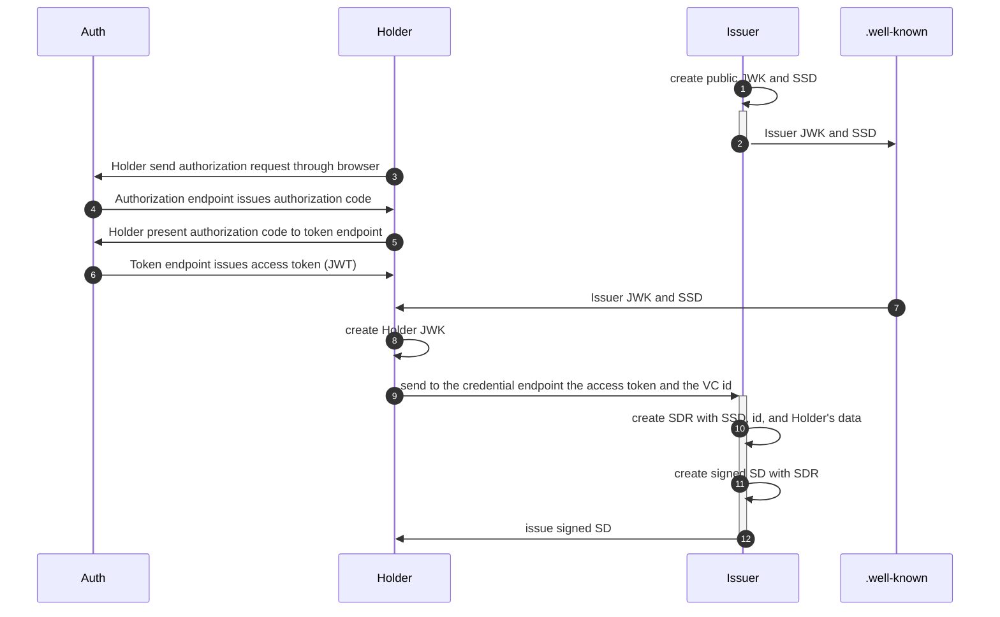

# Scenario 'SD-JWT' (Work in Progress)
 
**SD-JWT** stands for **Selective Disclosure for JWTs** that is 
"a mechanism for selective disclosure of individual elements of a JSON object used as the payload of a JSON Web Signature (JWS) structure. It encompasses various applications, including but not limited to the selective disclosure of JSON Web Token (JWT) claims." following this [specification](https://datatracker.ietf.org/doc/draft-ietf-oauth-selective-disclosure-jwt/).

In this context we have three main characters:

- The **Issuer**: an authority that issue Verifiable Credentials containing claims that are selectively disclosable to other partecipants;
- The **Holder**: any partecipant that request for a credential;
- The **Verifier**: any third party that want to verify the validity of an Holder's credential or a subset of claims contained in it.

## Credential Issuance

The **credential issuance** includes all the necessary steps that an Holder and an Issuer have to perform in order to create a new **Verifiable Credential** (VC).
This includes the authentication process of the Holder and the verification of its personal data, both in the sense of completeness of the information needed to issue the particular credential, and the correctness and reliability of it.

In order to give more details about the credential issuance flow, we need to introduce two more parties:
- The **Authorization Server** which is the server issuing access tokens to the client after successfully authenticating the resource owner and obtaining authorization;
- The **.wellknown** which is a directory on http server that contains the Issuer public metadata and that can be accessed also by the Holder.

Then we can describe the credential issuance flow with the following diagram:


Where we have:
- SSD = **Supported Selective Disclosure** is a JWT containing information about the Issuer and the Authorization Server and a list of supported credentials, each containing (at least) a unique identifier id, a list of mandatory attributes to issue the credential, a list of supported ciphersuites;
- SDR = **Selective Disclosure Request** is a dictionary with the JWT containing all the claims for the selected credential filled with the Holder's data and a list of the fields to be made seletively disclosable.

**TODO** first 9 steps. Now we are assuming that the Holder has identified himself to the Authorization Server, and have sent the request for a specific type of credential to the Issuer. Moreover we assume that at this point the Issuer can somehow access the Holder's data in such a way that he already trust this informations.

At this step of the flow both the Issuer and the Holder can access the Issuer Metadata in ./well-known that contains the list of supported credentials, each of them identified by a unique **id**.

The Issuer checks that the id selected by the Holder corresponds to a supported credential, and construct a **Selective Disclosure Request** which contains a list **fields** of the claims that must be made selectively disclosable, and a dictionary **object** containing all the claims with the Holder's data.

The input file to create the request should look like:

[](../_media/examples/zencode_cookbook/sd_jwt/create_request.json ':include :type=code json')

The following code is used to obtain a Selective Disclosure Request:

[](../_media/examples/zencode_cookbook/sd_jwt/create_request.zen ':include :type=code gherkin')

The output file should look like:

[](../_media/examples/zencode_cookbook/sd_jwt/create_request_out.json  ':include :type=code json')

When the Issuer has a Selective Disclosure Request, 
it creates the **Selective Disclosure**, which contains the JWT payload of the SD-JWT and the list of all the Disclosures.
Then the Issuer sign the payload contructing a JWS and return the **Signed Selective Disclosure** that contains also the list of all the Disclosures in serialized form.

The Disclosures should be kept private by the Holder, unless he wants to prove to a Verifier some specific claims.

The input file to create the SD-JWT should look like:

[](../_media/examples/zencode_cookbook/sd_jwt/create_signed_sd.json ':include :type=code json')

The following contract construct the SD and the Signed SD:

[](../_media/examples/zencode_cookbook/sd_jwt/create_signed_sd.zen ':include :type=code gherkin')

The output file should look like:

[](../_media/examples/zencode_cookbook/sd_jwt/create_signed_sd_out.json  ':include :type=code json')

It is also possible to return the SD-JWT as a JWT substituting the last line of the contract above with the following:

```gherkin
Then print 'signed_selective_disclosure' as 'decoded_selective_disclosure'
```

This should give an output like:

[](../_media/examples/zencode_cookbook/sd_jwt/create_signed_sd_out_sdjwt.json  ':include :type=code json')

**Note** that one can also upload a SD-JWT in decoded form with a statement like:

```gherkin
Given I have a 'decoded_selective_disclosure' named 'signed_selective_disclosure'
```

## Credential Presentation

An Holder who is already in possession of a SD-JWT can be asked to present its credential to a third part called the **Verifier**, who can (optionally) require the Holder to disclose some of the claims that are blinded in the JWT.

In order to contruct the **Selective Disclosure Presentation**, the Holder can use an input file that looks like:

[](../_media/examples/zencode_cookbook/sd_jwt/presentation.json ':include :type=code json')

Then it can execute the following contract:

[](../_media/examples/zencode_cookbook/sd_jwt/presentation.zen ':include :type=code gherkin')

This return the output:

[](../_media/examples/zencode_cookbook/sd_jwt/presentation_out.json ':include :type=code json')

## Credential Verification

A Verifier that wants to validate the credential of a partecipant needs the Holder SD-prensentation and the Issuer public key to verify the signature.
So given an input file like:

[](../_media/examples/zencode_cookbook/sd_jwt/verify_cred.json ':include :type=code json')

One can use a script like the following to verify the validity of the presented credential:

[](../_media/examples/zencode_cookbook/sd_jwt/verify_cred.zen ':include :type=code gherkin')
