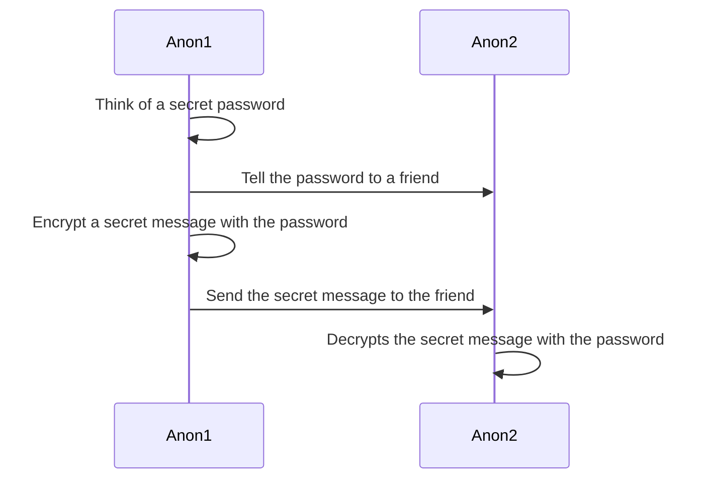
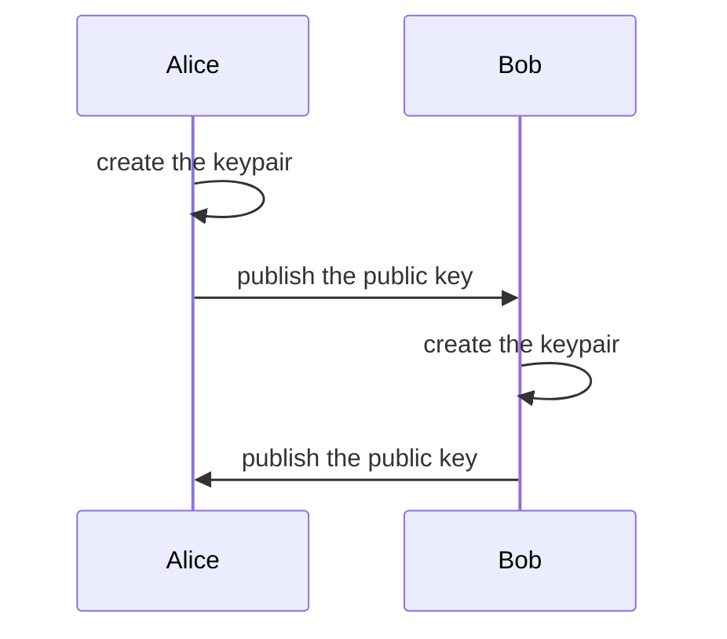
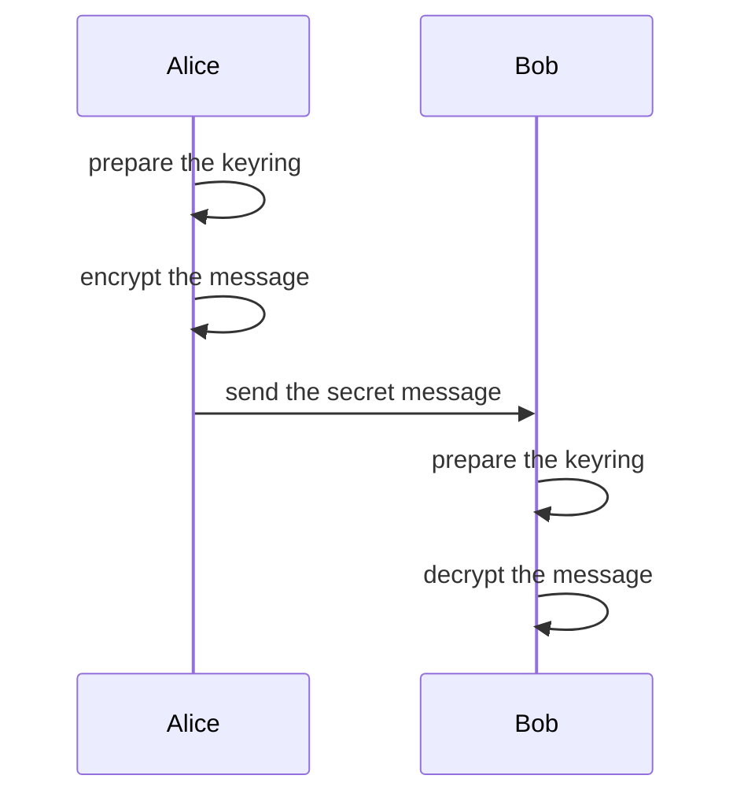
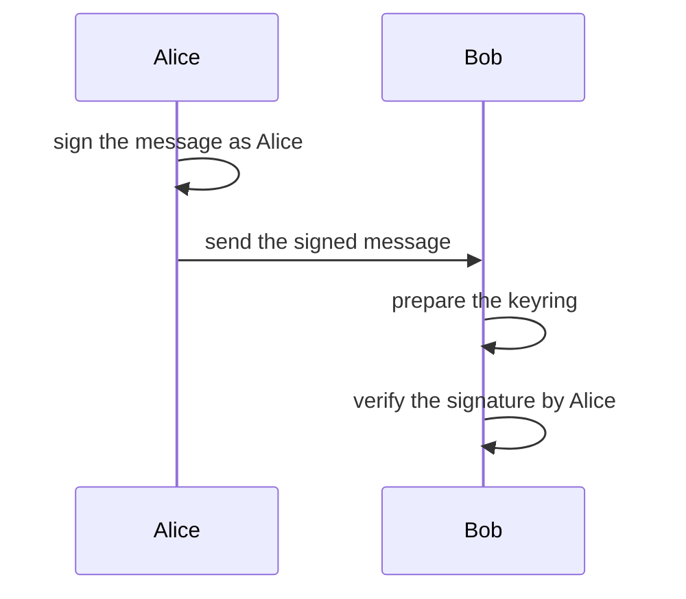
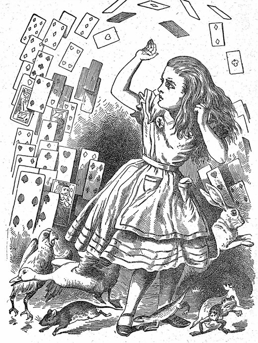
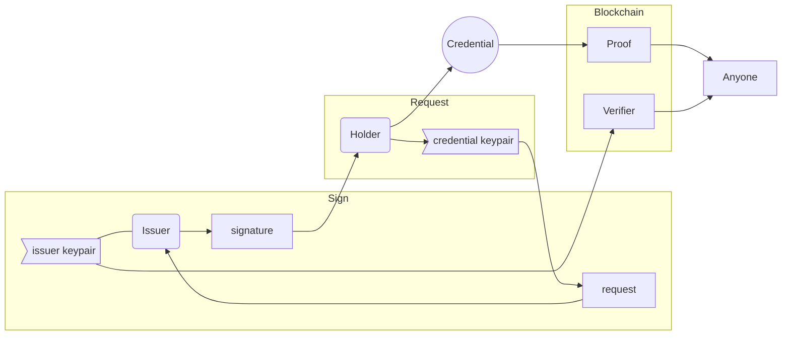
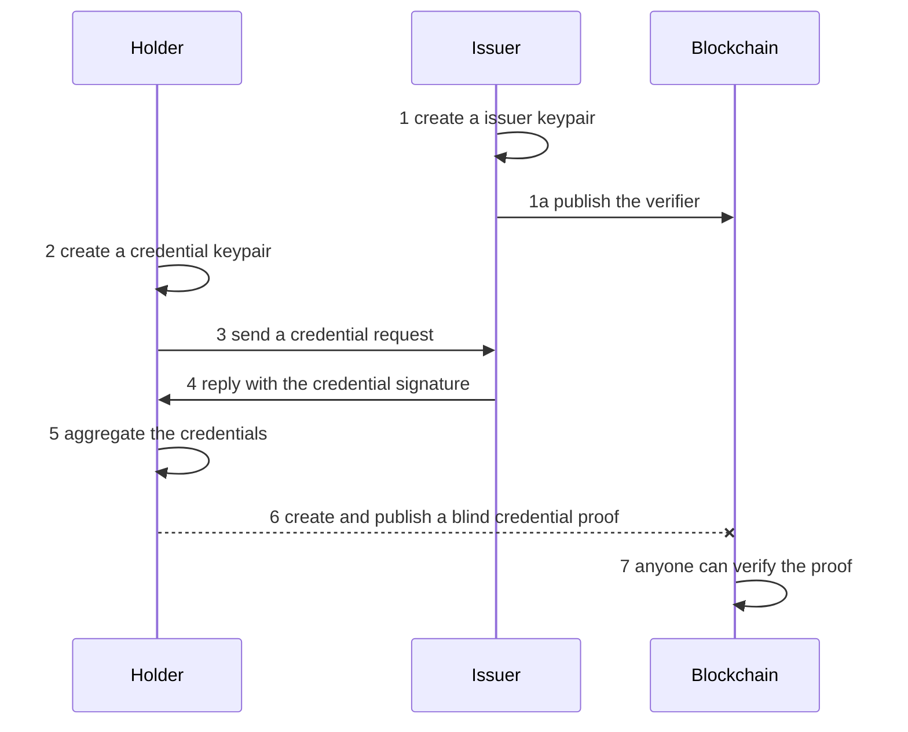

# Smart contracts in human language

Zenroom's development is heavily inspired by the [language-theoretical security](http://langsec.org) research and the [BDD Language](https://en.wikipedia.org/wiki/Behavior-driven_development). 

Zenroom can execute smart contracts written in the  domain-specific language **Zencode**, which reads in a [natural English-like fashion](https://decodeproject.eu/blog/smart-contracts-english-speaker), and allows to perform cryptographic operations as long as more traditional data manipulation.

For the theoretical background see the [Zencode Whitepaper](https://files.dyne.org/zenroom/Zencode_Whitepaper.pdf).

Here we go with the <span class="big">**tutorial to learn the Zencode language!**</span>

# Introduction

Zencode contracts operate in 3 phases:

1. **Given** - validates the input
2. **When** - processes the contents
3. **Then** - prints out the results

The 3 separate blocks of code also correspond to 3 separate memory areas, sealed by security measures.

If any single line in a Zencode contract fails, Zenroom stops executing and returns the error.


All data processed has first to pass the validation phase according to scenario specific data schemas.

<span class="mdi mdi-lightbulb-on-outline"></span>
**Good Practice**: start your Zencode noting down the Zenroom version you are using!

```
rule check version 1.0.0
```

---

# Symmetric cryptography

This is a simple technique to hide a secret using a common password known to all participants.

The algorithm used is
[AES-GCM](https://en.wikipedia.org/wiki/Galois/Counter_Mode) with a random IV and an optional authenticated header ([AEAD](https://en.wikipedia.org/wiki/Authenticated_encryption))

The encryption is applied using 3 arguments:

- `password` can be any string (or file) used to lock and unlock the secret
- `message` can be any string (or file) to be encrypted and decrypted
- `header` is a fixed name and optional argument to indicate an authenticated header

These 3 arguments can be written or imported, but must given before using the `I encrypt` block:

[](../_media/examples/zencode_ecdh/SYM02.zen ':include :type=code gherkin')

The output is returned in `secret message` and it looks like:

[](../_media/examples/zencode_ecdh/cipher_message.json ':include :type=code json')

To decode make sure to have that secret password and that a valid `secret message` is given, then use:

[](../_media/examples/zencode_ecdh/SYM03.zen ':include :type=code gherkin')

So let's imagine I want to share a secret with someone and send secret messages encrypted with it:



Of course the password must be known by all participants and that's the
dangerous part, since it could be stolen.

We mitigate this risk using **public-key cryptography**, also known as
**a-symmetric encryption**, explained below.


# Asymmetric cryptography

We use [asymmetric encryption (or public key
cryptography)](https://en.wikipedia.org/wiki/Public-key_cryptography)
when we want to introduce the possession of **keypairs** (public and private) both by
Alice and Bob: this way there is no need for a single secret to be known to both.

Fortunately it is pretty simple to do using Zencode in 2 steps

- Key generation and exchange ([SETUP](https://en.wikipedia.org/wiki/Key_exchange))
- Public-key Encryption or signature ([ECDH](https://en.wikipedia.org/wiki/Elliptic-curve_Diffie%E2%80%93Hellman) and [ECDSA](https://en.wikipedia.org/wiki/Elliptic_Curve_Digital_Signature_Algorithm))

## Key generation and exchange

In this phase each participant will create his/her own keypair, store it and communicate the public key to the other.

The statement to generate a keypair (public and private keys) is simple:

[](../_media/examples/zencode_ecdh/alice_keygen.zen ':include :type=code gherkin')

It will produce something like this:

[](../_media/examples/zencode_ecdh/alice_keypair.json ':include :type=code json')

Where the public key is usually a longer octet and actually an [Elliptic Curve Point](/lua/modules/ECP.html) coordinate.

There is nothing preventing an host application to separate these JSON
fields and store them in any secure way.

Here we demonstrate how to create keypairs as well separate them using
Zencode:

- 2 contracts to create Alice and Bob keypairs
- 2 contracts to separate the public key from the private key for each



After both Alice and Bob have their own keypairs and they both know
each other public key we can move forward to do asymmetric encryption
and signatures.

[](../_media/examples/zencode_ecdh/alice_keypub.zen ':include :type=code gherkin')


[](../_media/examples/zencode_ecdh/alice_pub.json ':include :type=code json')

The advantage of using Zencode here is the use of the `valid` keyword which effectively parses the `public key` object and verifies it as valid, in this case as being a valid point on the elliptic curve in use. This greatly reduces the possibility of common mistakes.

## Public-key Encryption (ECDH)

Public key encryption is similar to the [asymmetric
encryption](#asymmetric-encryption) explained in the previous section,
with a difference: the `from` and `for` clauses indicating the public
key of the recipient.

Before getting to the encryption 2 other objects must be given:

- `keypair` is one's own public and private keys
- `public key` from the intended recipient

So with an input separated between DATA and KEYS or grouped together in an array like:

[](../_media/examples/zencode_ecdh/bob_keyring.json ':include :type=code json')

[](../_media/examples/zencode_ecdh/AES05.zen ':include :type=code gherkin')

which encrypts and stores results in `secret message`; also in this case `header` may be given, then is included in the encryption as an authenticated clear-text section.




**1. Alice encrypts the message using Bob's public key**

[](../_media/examples/zencode_ecdh/AES05.zen ':include :type=code gherkin')

**2. Bob prepares a keyring with Alice's public key**

[](../_media/examples/zencode_ecdh/AES06.zen ':include :type=code gherkin')

**3. Bob decrypts the message using Alice's public key**

[](../_media/examples/zencode_ecdh/AES07.zen ':include :type=code gherkin')

In this basic example the session key for encryption is made combining
the private key of Alice and the public key of Bob (or
vice versa).

```gherkin
	When I write 'my secret for you' in 'message'
	and I write 'an authenticated message' in 'header'
```

The decryption will always check that the header hasn't changed,
maintaining the integrity of the string which may contain important
public information that accompany the secret.

## Public-key Signature (ECDSA)

Public-key signing allows to verify the integrity of a message by
knowing the public key of all those who have signed it.

It is very useful when in need of authenticating documents: any change
to the content of a document, even one single bit, will make the
verification fail, showing that something has been tampered with.

The one signing only needs his/her own keypair, so the key setup will
be made by the lines:

```gherkin
	Given that I am known as 'Alice'
	and I have my valid 'keypair'
```

then assuming that the document to sign is in `draft`, Alice can
proceed signing it with:

```gherkin
	and I create the signature of 'draft'
```

which will produce a new object `signature` to be printed along the
draft: the original message stays intact and the signature is detached.

On the other side Bob will need Alice's public key to verify the
signature with the line:

```gherkin
	When I verify the 'draft' is signed by 'Alice'
```

which will fail in case the signature is invalid or the document has
been tampered with.



Here we continue assuming that the keyrings are already prepared with
public/private keypairs and the public keypair of the correspondent.

**1. Alice signs a message for Bob**

[](../_media/examples/zencode_ecdh/DSA01.zen ':include :type=code gherkin')

**1. Bob verifies the signed message from Alice**

[](../_media/examples/zencode_ecdh/DSA02.zen ':include :type=code gherkin')

In this example Alice uses her private key to sign and authenticate a
message. Bob or anyone else can use Alice's public key to prove that
the integrity of the message is kept intact and that she signed it.

# Zero Knowledge Proof

In this chapter we'll look at some more advanced cryptography, namely the 'Attribute Based Credentials' and the 'Zero Knowledge Proof': this is powerful and complex feature
implemented using the [Coconut crypto scheme](https://arxiv.org/pdf/1802.07344.pdf). 

Zencode supports several features based on pairing elliptic curve
arithmetics and in particular:

- non-interactive zero knowledge proofs (also known as ZKP or ZK-Snarks)
- threshold credentials with multiple decentralised issuers
- homomorphic encryption for numeric counters

These are all very useful features for architectures based on the
decentralisation of trust, typical of **DLT and blockchain based
systems, as well for off-line and non-interactive authentication**.

The Zencode language leverages two main scenarios, more will be
implemented in the future.

1. Attribute Based Credentials (ABC) where issuer verification keys
   represent specific credentials
2. A Petition system based on ABC and homomorphic encryption

Three more are in the work and they are:

1. Anonymous proxy validation scheme
2. Token thumbler to privately transfer numeric assets
3. Private credential revocation


## Attribute Based Credentials

 

Let's imagine 3 different subjects for our scenarios:

1. **Mad Hatter** is a well known **credential issuer** in Wonderland
2. **Wonderland** is an open space (a blockchain!) and all inhabitants can check the validity of **proofs**
3. **Alice** just arrived: to create **proofs** she'll request a **credential** to the issuer **MadHatter**

When **Alice** is in possession of **credentials** then she can
create a **proof** any time she wants using as input:

- the **credentials**
- her **credential keypair**
- the **verifier** by MadHatter
[](../_media/examples/zencode_ecdh/create_proof.zen ':include :type=code gherkin')

All these "things" (credentials, proofs, etc.) are data structures that can be used as input and received as output of Zencode functions. For instance a **proof** can be print in **JSON** format and looks a bit list this:

```json
{
   "credential_proof" : {
      "pi_v" : {
         "c" : "u64:tBrCGawWYEAi55_hHIPq0JT3OaapOebSHVW0GhjJcAk",
         "rr" : "u64:J7R3FXsI2dcfyZRCqWA8fDYijG39P16LvGpX90wtCWw",
         "rm" : "u64:QoG-28CNTAY3Ir4SQqVoK1ZpTlzOnXxX6Xtq5KMIxpo"
      },
      "nu" : "u64:BA77WYvBRsc53uAyrqTjuUdptJPZbcTlzr9icizm0...",
      "sigma_prime" : {
         "h_prime" : "u64:BB9AM5xjWPxsZ47zh1WAmFymru66W6YuK...",
         "s_prime" : "u64:BAGYNM6JO0wRAGE87_-bQVuhUXeEoeJrh..."
      },
      "kappa" : "u64:GFVYsudbHOJNzPl3ZL0_VzB_DRvrPKF26OCZR9..."
   },
   "zenroom" : {
      "scenario" : "coconut", "encoding" : "url64", "version" : "1.0.0"
   }
}
```

Anyone can verify proofs using as input:

- the **credential proof**
- the **verifier** by MadHatter
[](../_media/examples/zencode_ecdh/verify_proof.zen ':include :type=code gherkin')

What is so special about these proofs? Well!  Alice cannot be followed
by her trail of proofs: **she can produce an infinite number of
proofs, always different from one another**, for anyone to recognise
the credential without even knowing who she is.


Imagine that once **Alice** is holding **credentials** she can enter
any room in Wonderland and drop a **proof** in the chest at its
entrance: this proof can be verified by anyone without disclosing
Alice's identity.

The flow described above is pretty simple, but the steps to setup the
**credential** are a bit more complex. Lets start using real names
from now on:

- Alice is a credential **Holder**
- MadHatter is a credential **Issuer**
- Wonderland is a public **Blockchain**
- Anyone is any peer connected to the blockchain



To add more detail, the sequence is:




1 **MadHatter** generates an **issuer keypair**
<table><tr><th>Input</th><th>Zencode</th><th>Output</th></tr>
<tr><td> - </td><td>


[](../_media/examples/zencode_coconut/issuer_keygen.zen ':include :type=code gherkin')


</td>
<td>issuer_keypair</td>
</tr></table>

1a **MadHatter** publishes the **verification key**
<table><tr><th>Input</th><th>Zencode</th><th>Output</th></tr>
<tr><td> issuer_keypair </td><td>


[](../_media/examples/zencode_coconut/publish_verifier.zen ':include :type=code gherkin')


</td>
<td>issuer_verifier</td>
</tr></table>

2 **Alice** generates her **credential keypair**
<table><tr><th>Input</th><th>Zencode</th><th>Output</th></tr>
<tr><td> - </td><td>


[](../_media/examples/zencode_coconut/credential_keygen.zen ':include :type=code gherkin')


</td>
<td>credential_keypair</td>
</tr></table>

3 **Alice** sends her **credential signature request**
<table><tr><th>Input</th><th>Zencode</th><th>Output</th></tr>
<tr><td> credential_keypair </td><td>


[](../_media/examples/zencode_coconut/create_request.zen ':include :type=code gherkin')


</td>
<td>credential_request</td>
</tr></table>

4 **MadHatter** decides to sign a **credential signature request**
<table><tr><th>Input</th><th>Zencode</th><th>Output</th></tr>
<tr><td> credential_request<br/>issuer_keypair </td><td>


[](../_media/examples/zencode_coconut/issuer_sign.zen ':include :type=code gherkin')


</td>
<td>issuer_signature</td>
</tr></table>

5 **Alice** receives and aggregates the signed **credential**
<table><tr><th>Input</th><th>Zencode</th><th>Output</th></tr>
<tr><td> issuer_signature<br/>credential_keypair </td><td>


[](../_media/examples/zencode_coconut/aggregate_signature.zen ':include :type=code gherkin')


</td>
<td>credential</td>
</tr></table>


## Centralized credential issuance

Lets see how flexible is Zencode.

The flow described above is for a fully decentralized issuance of
**credentials** where only the **Holder** is in possession of the
**credential keypair** needed to produce a **credential proof**.

But let's imagine a much more simple use-case for a more centralized
system where the **Issuer** provides the **Holder** with everything
ready to go to produce zero knowledge credential proofs.

The implementation is very, very simple: just line up all the **When**
blocks where the different operations are done at different times and
print the results all together!

```gherkin
Scenario coconut
	Given that I am known as 'Issuer'
	When I create the issuer keypair
	and I create the credential keypair
	and I create the credential request
	and I create the credential signature
	and I create the credentials
	Then print the 'credentials'
	and print the 'credential keypair'
```

This will produce **credentials** that anyone can take and run. Just
beware that in this simplified version of ABC the **Issuer** may
maliciously keep the **credential keypair** and impersonate the
**Holder**.


# Proximity Tracing

Following up [this popular post on how to make decentralized
privacy-preserving proximity tracing using
zencode](https://medium.com/@jaromil/decentralized-privacy-preserving-proximity-tracing-cryptography-made-easy-af0a6ae48640)
this documentation will go through implementation details.

The Decentralized Privacy-Preserving Proximity Tracing (DP-3T)
protocol is described in the [DP-3T
Whitepaper](https://github.com/DP-3T/documents/).

If you are a mobile app developer or a tech-savvy person in general,
someone that can read and experiment with a shell script or javascript
or someone curious enough to know more how applied cryptography works,
then read on and you’ll be surprised how easy this is.


A software application implementing this scheme shall be capable of computing through 3 basic steps:

1. Setup the secret day key (SK)
2. Create a list of Ephemeral IDs (EphIDs)
3. Check the proximity to “infected” devices

The following sections will demonstrate how an application can do that
by embedding the Zenroom VM and using the special “DP3T” Zencode
scenario.

## Setup the SK

Execute the following Zencode:

[](../_media/examples/zencode_dp3t/dp3t_keygen.zen ':include :type=code gherkin')

This will output you a brand new “secret day key” (SK):

[](../_media/examples/zencode_dp3t/SK1.json ':include :type=code json')

If you have already created a new SK and want to renew, pass the
previous SK as input to Zenroom (either DATA or KEYS buffer) and run
this Zencode:

[](../_media/examples/zencode_dp3t/dp3t_keyderiv.zen ':include :type=code gherkin')

This will output a new SK in the same format but with different content:

[](../_media/examples/zencode_dp3t/SK2.json ':include :type=code json')

## Create the EphIDs

To generate a list of ephemeral IDs (EphIDs) for the day one should
have a renewed secret day key and an `epoch` number: the minutes
interval of `ephid` renewal during the day. Here we set `epoch` to
`180` thus producing 9 ephids and segmenting the day in 8 moments:
early morning, late morning, lunch, early afternoon, late afternoon,
dinner, early evening, late evening.

The current secret day key (SK) needs to be passed as input to the
following script as DATA or INPUT:

[](../_media/examples/zencode_dp3t/dp3t_ephidgen.zen ':include :type=code gherkin')

This will yield 9 EphIDs ready to use as output:

[](../_media/examples/zencode_dp3t/EphID_2.json ':include :type=code json')

This is a randomized array of EphIDs that the mobile application should broadcast at the different moments of the day.

## Check the proximity

Here we assume the mobile application will have received from an
online server the list of “infected SKs” identifiers, for instance as
a JSON file. This list will be very big (plausibly 20.000 entries) and
is truncated here, it will consist of an array of `list of infected`
secret day keys belonging to individuals willing to run the
application. For example:

```json
{
   "list_of_infected" : [
      "b2bf0a3038f3810d2b3fbd4f300b3d8827cf5fb0078c3bd3dc65c48481162820",
      "d843e0cec156f496e11f39f81e40708cf95341dad022a450924decd7e153354c",
      "64c200f8db42a03f9757529f6415aa452639039f2c92301b640c17b3889b6ccc",
      "595d59e1ddc733536e9943f29ad066904bb06802cfe8c216bdc9d67d0deb28f9",
      "e28668b87d50147848385b5adfc010f7fce516e57115220be49214d415a0e451",
      "3188ab1c837658bd906430d98b41eb3b6012c153282456abbaf622036f4996e9",
  ...
}
```

The mobile application will also have a list of EphIDs that were caught from the ether (broadcasted by other devices) and stored on the phone.

[](../_media/examples/zencode_dp3t/EphID_infected.json ':include :type=code json')

At this point the application will have to execute the following
Zencode to calculate if it has been in the proximity of any COVID-19
positive device:

[](../_media/examples/zencode_dp3t/dp3t_check.zen ':include :type=code gherkin')

This code will take a while to run, approx 2 seconds on a i5 2.4Ghz
CPU and 10 seconds on a phone, requiring approx 4MB of RAM to process
the `list of infected` array and check them on the `ephemeral ids`
collected. This script will then output an array of SKs that are
present in the infection list and that were in the proximity.

[](../_media/examples/zencode_dp3t/SK_proximity.json ':include :type=code json')

As it is visible in this example the SK of a single device (SK) will
be repeated in case it was in the proximity through different moments
of the day.
