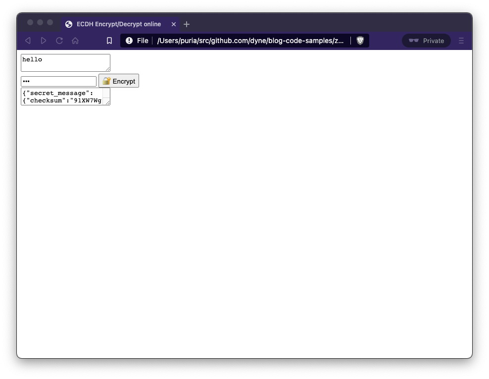
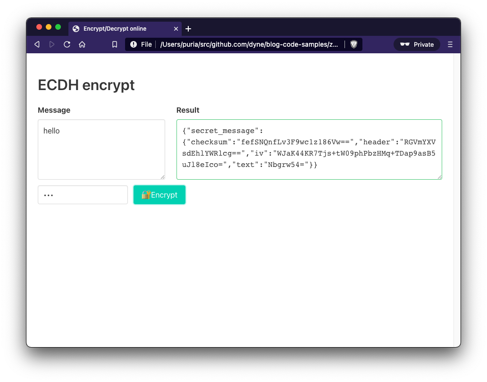
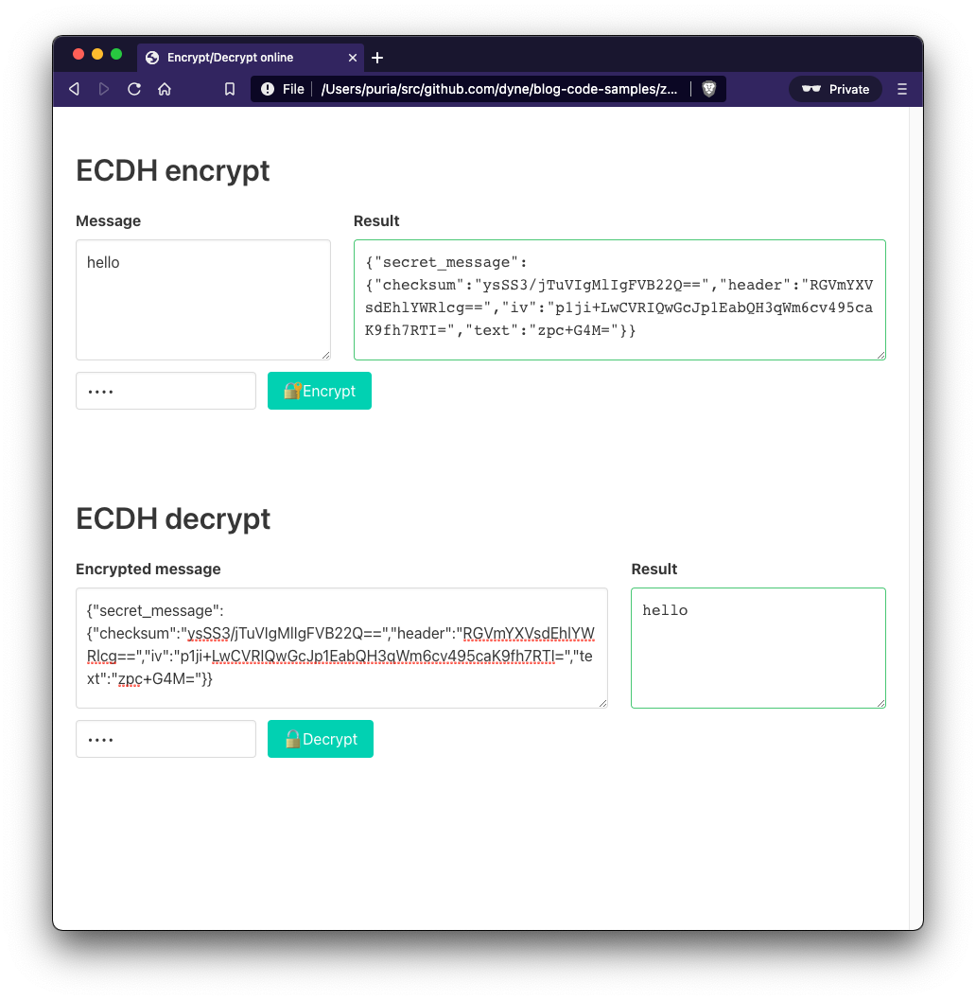

# Make 💏 with Zencode and Javascript: use Zenroom in the browser

This article is part of a series of tutorials about interacting with Zenroom VM inside the messy world of JavaScript/Typescript. 
By the end of the article you should be able to launch a new encryption service with Elliptic-curve Diffie–Hellman within your browser (Plain JS and HTML).

The code used in this article is available on [Github](https://github.com/dyne/blog-code-samples).


## 🏹 Let's create a encrypt/decrypt service
So you have just experimented how to encrypt and decrypt a message with a password/secret with ECDH (Elliptic-curve Diffie–Hellman) on the elliptic curve SECP256K1 (Did you? No? Then, jump back to [Zenroom in node.js](/pages/zenroom-javascript1b)).
Now say you love simple things and you just need some basic functions inside your HTML page (no npm, no nodejs, no fancy hipster new shiny stuff) with the good ol' Plain JavaScript.
NO PROBLEM. You bet we love it.

## 💻 Let’s get our hands dirty: 🔏 encryption 

Let's create an **index.html** file, the first thing that we want is to import our **zencode_exec** function

```html
<script type="module">
  import { zencode_exec } from "https://jspm.dev/zenroom@next";
</script>
```

This is a no brainer with CDNs like jspm that allows you to [import JavaScript modules](https://developer.mozilla.org/en-US/docs/Web/JavaScript/Guide/Modules). The jspm site says:

*jspm provides a module CDN allowing any package from npm to be directly loaded in the browser and other JS environments as a fully optimized native JavaScript module.*

So this is handy and neat, let's move on. Remember the encryption function? Let's copy paste it, and in place of getting password and message as function parameters we retrieve them from two HTMLElements and print the output to a third element

```html
<!DOCTYPE html>
<html>
  <head>
    <meta charset="utf-8" />
    <meta name="viewport" content="width=device-width, initial-scale=1" />
    <title>ECDH Encrypt/Decrypt online</title>
    <script type="module">
      import { zencode_exec } from "https://jspm.dev/zenroom@next";
      
      const conf = "memmanager=lw";
      
      window.encrypt = () => {
        const password = document.getElementById('encryptPassword').value
        const message = document.getElementById('plainMessage').value
        const keys = JSON.stringify({ password });
        const data = JSON.stringify({ message });
        const contract = `Scenario 'ecdh': Encrypt a message with a password/secret 
          Given that I have a 'string' named 'password' 
          and that I have a 'string' named 'message' 
          When I encrypt the secret message 'message' with 'password' 
          Then print the 'secret message'`;
        zencode_exec(contract, { data, keys, conf }).then(({result}) => {
          const rel = document.getElementById('encrypted')
          rel.value = result
        })
      }
    </script>
  </head>
  <body>
     <textarea id="plainMessage"></textarea>
     <br/>
     <input id="encryptPassword" class="input" type="password" />
     <button onClick="encrypt()">🔐 Encrypt</button>
     <br/>
     <textarea id="encrypted" readonly></textarea>
  </body>
</html>
```

The expected result is something like:



It's ugly, almost unusable, but It works! 🥳
A couple of hints to pay attention, as I said before. We'll use JavaScript module so *type="module"* on the *script* tag is important. Since we are inside the module scope to make the encrypt() function available to our page we should add it to the window object, so take an eye to line 12 of the previous snippet.
Let's add a couple lines of styling (not so much) and some visual feedback on successful encryption. I'll use [bulma](https://bulma.io/) here, a super easy CSS framework.


```html
<!DOCTYPE html>
<html>
  <head>
    <meta charset="utf-8" />
    <meta name="viewport" content="width=device-width, initial-scale=1" />
    <title>Encrypt/Decrypt online</title>
    <link
      rel="stylesheet"
      href="https://cdn.jsdelivr.net/npm/bulma@0.9.1/css/bulma.min.css"
    />
    <script type="module">
      import { zencode_exec } from "https://jspm.dev/zenroom@next";

      const conf = "memmanager=lw";

      window.encrypt = () => {
        const password = document.getElementById('encryptPassword').value
        const message = document.getElementById('plainMessage').value
        const keys = JSON.stringify({ password });
        const data = JSON.stringify({ message });
        const contract = `Scenario 'ecdh': Encrypt a message with a password/secret 
          Given that I have a 'string' named 'password' 
          and that I have a 'string' named 'message' 
          When I encrypt the secret message 'message' with 'password' 
          Then print the 'secret message'`;
        zencode_exec(contract, { data, keys, conf }).then(({result}) => {
          const rel = document.getElementById('encrypted')
          rel.value = result
          rel.classList.add("is-success");
        })
      };
    </script>
  </head>
  <body>
    <section class="section">
      <div class="container">
        <h1 class="title">ECDH encrypt</h1>
        <div class="columns">
          <div class="column is-one-third">
            <div class="field">
              <label class="label">Message</label>
              <div class="control">
                <textarea
                  id="plainMessage"
                  class="textarea"
                  placeholder="Message to encrypt"
                ></textarea>
              </div>
            </div>
            <div class="field is-grouped">
              <div class="control">
                  <input class="input" 
                    type="password" placeholder="password" id="encryptPassword">
              </div>
              <div class="control">
                <button 
                  class="button is-primary"
                  onClick="encrypt()">🔐 Encrypt</button>
              </div>
            </div>
          </div>
          <div class="column">
            <label class="label">Result</label>
            <div class="control">
              <textarea
                id="encrypted"
                class="textarea is-family-monospace"
                readonly
              ></textarea>
            </div>
          </div>
        </div>
      </div>
    </section>
  </body>
</html>
```
That will show something like:



Yeah this is much better 💅🏼

## 🔏 Next step: decryption 


Let's add also the decrypt function and we are ready to deploy our static and super fast ECDH encrypt/decrypt service over the WWW.


```html
<!DOCTYPE html>
<html>
  <head>
    <meta charset="utf-8" />
    <meta name="viewport" content="width=device-width, initial-scale=1" />
    <title>Encrypt/Decrypt online</title>
    <link
      rel="stylesheet"
      href="https://cdn.jsdelivr.net/npm/bulma@0.9.1/css/bulma.min.css"
    />
    <script type="module">
      import { zencode_exec } from "https://jspm.dev/zenroom@next";

      const conf = "memmanager=lw";

      window.encrypt = () => {
        const password = document.getElementById('encryptPassword').value
        const message = document.getElementById('plainMessage').value
        const keys = JSON.stringify({ password });
        const data = JSON.stringify({ message });
        const contract = `Scenario 'ecdh': Encrypt a message with a password/secret 
          Given that I have a 'string' named 'password' 
          and that I have a 'string' named 'message' 
          When I encrypt the secret message 'message' with 'password' 
          Then print the 'secret message'`;
        zencode_exec(contract, { data, keys, conf }).then(({result}) => {
          const rel = document.getElementById('encrypted')
          rel.value = result
          rel.classList.add("is-success");
        }).catch(({logs}) => {
          const rel = document.getElementById('encrypted')
          rel.value = logs
          rel.classList.add("is-danger");  
        })
      };

      window.decrypt = () => {
        const password = document.getElementById('decryptPassword').value;
        const keys = JSON.stringify({ password });
        const data = document.getElementById('encryptedMessage').value;
        const contract = `Scenario 'ecdh': Decrypt the message with the password 
          Given that I have a valid 'secret message' 
          Given that I have a 'string' named 'password' 
          When I decrypt the text of 'secret message' with 'password' 
          Then print the 'text' as 'string'`;
        zencode_exec(contract, { data, keys, conf }).then(({result}) => {
          const decrypted = JSON.parse(result).text;
          const rel = document.getElementById('decrypted')
          rel.value = decrypted
          rel.classList.add("is-success");
        }).catch(({logs}) => {
          const rel = document.getElementById('decrypted')
          rel.value = logs
          rel.classList.add("is-danger");  
        });
      };
    </script>
  </head>
  <body>
    <section class="section">
      <div class="container">
        <h1 class="title">ECDH encrypt</h1>
        <div class="columns">
          <div class="column is-one-third">
            <div class="field">
              <label class="label">Message</label>
              <div class="control">
                <textarea
                  id="plainMessage"
                  class="textarea"
                  placeholder="Message to encrypt"
                ></textarea>
              </div>
            </div>

            <div class="field is-grouped">
              <div class="control">
                  <input class="input" type="password" placeholder="password" id="encryptPassword">
              </div>
              <div class="control">
                <button class="button is-primary" onClick="encrypt()">🔐 Encrypt</button>
              </div>
            </div>
          </div>
          <div class="column">
            <label class="label">Result</label>
            <div class="control">
              <textarea
                id="encrypted"
                class="textarea is-family-monospace"
                readonly
              ></textarea>
            </div>
          </div>
        </div>
      </div>
    </section>
    <section class="section">
      <div class="container">
        <h1 class="title">ECDH decrypt</h1>
        <div class="columns">
          <div class="column">
            <div class="field">
              <label class="label">Encrypted message</label>
              <div class="control">
                <textarea
                  id="encryptedMessage"
                  class="textarea"
                  placeholder="Message to decrypt"
                ></textarea>
              </div>
            </div>

            <div class="field is-grouped">
              <div class="control">
                  <input class="input" type="password" placeholder="password" id="decryptPassword">
              </div>
              <div class="control">
                <button class="button is-primary" onClick="decrypt()">🔓 Decrypt</button>
              </div>
            </div>
          </div>
          <div class="column is-one-third">
            <label class="label">Result</label>
            <div class="control">
              <textarea
                id="decrypted"
                class="textarea is-family-monospace"
                readonly
              ></textarea>
            </div>
          </div>
        </div>
      </div>
    </section>
  </body>
</html>
```

The final result is something like



You can try it by yourself, encrypt a message with a password, then copy/paste the result into the **Encrypted message** field and if you put the same password the message is decrypted and the result is correctly shown.

What if the password is wrong? Validation is demanded just in the ZenroomVM so I've just added a *catch* to the *zencode_exec* promise (see line 51–55) that will show the logs in the result element if something goes wrong!

The code used in this article is available on [Github](https://github.com/dyne/blog-code-samples).