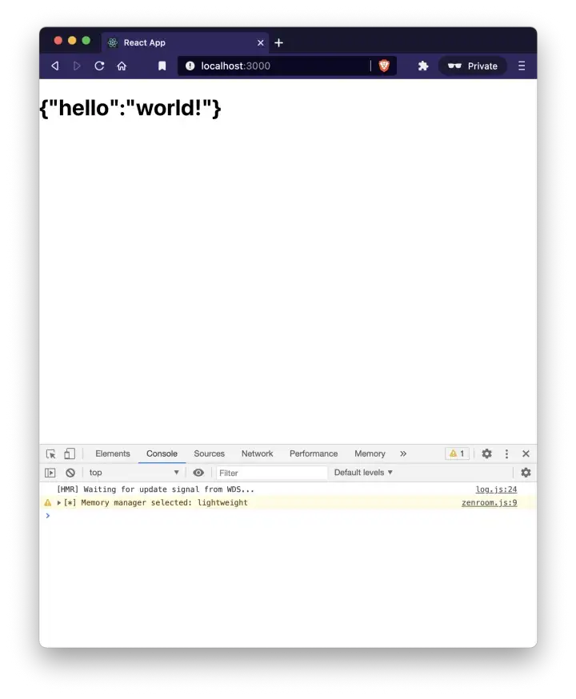
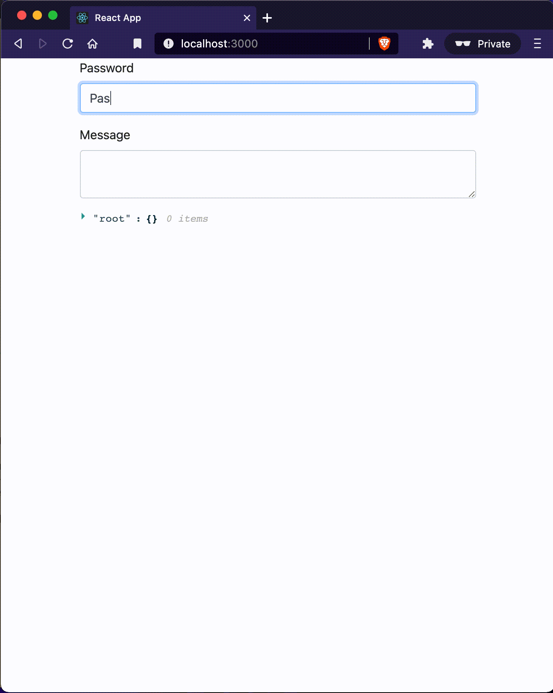

# Make ❤️  with Zenroom and Javascript (part 3)


## 🏹 Let’s create a encrypt/decrypt service
So you have just experimented how to encrypt and decrypt a message with a password/secret with ECDH (Elliptic-curve Diffie–Hellman) on the elliptic curve SECP256K1 in Plain Javascript (Did you? No? Then, jump back to [Zenroom in the browser](zenroom-javascript2b)).

Now let's add some interactivity and see how we can play and interact with Zencode smart contracts within React.


## 💻 Let’s get our hands dirty

Let’s start by creating a standard React project with the [CRA](https://reactjs.org/docs/create-a-new-react-app.html) tool, and add Zenroom as a dependency

```bash
npx create-react-app zenroom-react-test
```

You should now have into `zencode-encrypt` a file structure like this


```bash
.
├── README.md
├── package.json
├── public
│   ├── favicon.ico
│   ├── index.html
│   ├── logo192.png
│   ├── logo512.png
│   ├── manifest.json
│   └── robots.txt
├── src
│   ├── App.css
│   ├── App.js
│   ├── App.test.js
│   ├── index.css
│   ├── index.js
│   ├── logo.svg
│   ├── reportWebVitals.js
│   └── setupTests.js
└── yarn.lock
```


Let's add **zenroom** as a dependency

```bash
$ yarn add — dev zenroom
yarn add v1.22.10
[1/4] 🔍 Resolving packages…
[2/4] 🚚 Fetching packages…
[3/4] 🔗 Linking dependencies…
[4/4] 🔨 Building fresh packages…
success Saved lockfile.
success Saved 1 new dependency.
info Direct dependencies
└─ zenroom@2.2.0-f6d8035
info All dependencies
└─ zenroom@2.2.0-f6d8035
✨ Done in 11.59s.
```


We are now ready to start with our `hello world` smart contract!

Edit the `App.js` as such:


```javascript
import {useEffect, useState} from 'react'
import {zencode_exec} from 'zenroom'

function App() {
  const [result, setResult] = useState("");

  useEffect(() => {
    const exec = async () => {
      const smartContract = `Given that I have a 'string' named 'hello'
                             Then print all data as 'string'`
      const data = JSON.stringify({ hello: 'world!' })
      const conf = 'memmanager=lw'
      const {result} = await zencode_exec(smartContract, {data, conf});
      setResult(result)
    }

    exec()
  })


  return (
    <h1>{result}</h1>
  );
}

export default App;
```

and now if you run the server with

```bash
yarn start
```


You are good to go, open `http://localhost:3000/` and you should see something like: 




Hoorayyy!!!  You just run a Zencode smart contract in React with no fuss. 🥳🥳🥳 And with this now you are able to maybe create your `<Zencode>` or `<Zenroom>` components and endless creative and secure possibilities.


## 🔏 Let’s complicate it a bit! Let’s encrypt!

Now that we saw how the basics works, let’s proceed with some sophistication: let’s encrypt a message with a password/secret with **ECDH (Elliptic-curve Diffie–Hellman)** on the elliptic curve SECP256K1 sounds complicated, isn’t it?


```javascript
import { useEffect, useState } from "react";
import { zencode_exec } from "zenroom";
import { Form, FormGroup, Label, Input, Container } from "reactstrap";
import ReactJson from "react-json-view";

function App() {
  const [result, setResult] = useState({});
  const [message, setMessage] = useState("");
  const [password, setPassword] = useState("");

  useEffect(() => {
    const conf = "memmanager=lw";
    const encrypt = async (message, password) => {
      if (!message || !password) return;
      const keys = JSON.stringify({ password });
      const data = JSON.stringify({ message });
      const contract = `Scenario 'ecdh': Encrypt a message with a password/secret 
        Given that I have a 'string' named 'password' 
        and that I have a 'string' named 'message' 
        When I encrypt the secret message 'message' with 'password' 
        Then print the 'secret message'`;
      const { result } = await zencode_exec(contract, { data, keys, conf });
      setResult(JSON.parse(result));
    };

    encrypt(message, password);
  }, [message, password]);

  return (
    <Container>
      <Form>
        <FormGroup>
          <Label for="password">Password</Label>
          <Input
            type="text"
            name="password"
            id="password"
            onChange={(e) => {
              setPassword(e.target.value);
            }}
          />
        </FormGroup>
        <FormGroup>
          <Label for="message">Message</Label>
          <Input
            type="textarea"
            id="message"
            onChange={(e) => {
              setMessage(e.target.value);
            }}
          />
        </FormGroup>
      </Form>
      <ReactJson src={result} />
    </Container>
  );
}

export default App;
```

Et voila 🤯 as easy as the hello the world! We added an encryption function, and some component to give some styling. If you run it you’ll get something like:





It's embarrassing fast, encryption with password over Elliptic-curve Diffie–Hellman on curve SECP256K1 in react! Now hold tight until next week for the part 4… in the meantime clap this post and spread it all over the socials. 

One last thing, you’ll find the working code project on [Github](https://github.com/dyne/blog-code-samples/tree/master/zencode-javascript-series/part3-react)


