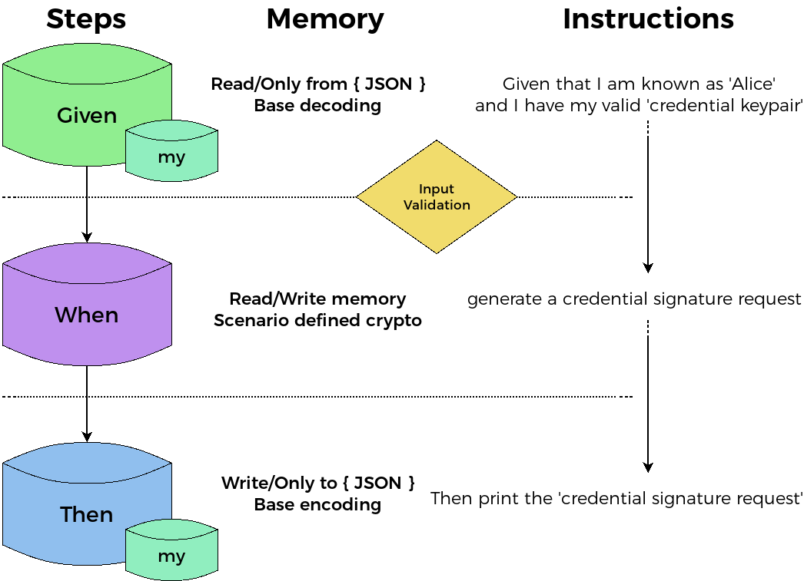
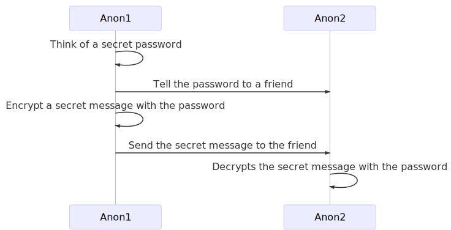
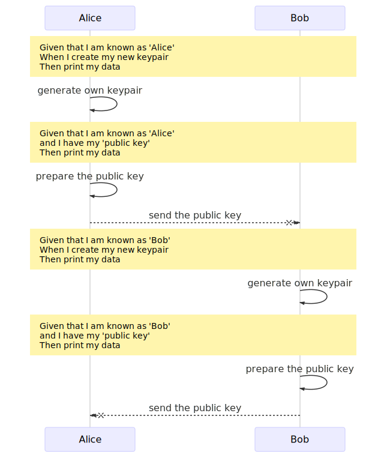
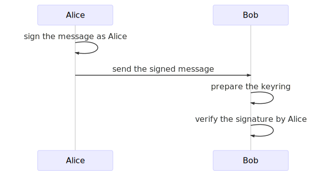
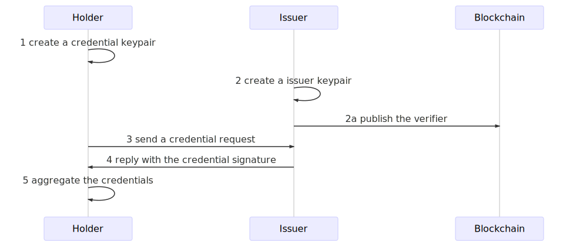

# Smart contracts in human language

Zenroom is software inspired by the [language-theoretical security](http://langsec.org) research and it allows to express cryptographic operations in a readable domain-specific language called **Zencode**.

For the theoretical background see the [Zencode Whitepaper](https://files.dyne.org/zenroom/Zencode_Whitepaper.pdf).

For an introduction see this blog post: [Smart contracts for the English speaker](https://decodeproject.eu/blog/smart-contracts-english-speaker).

Here we go with the <span class="big">**tutorial to learn the Zencode language!**</span>

# Syntax and Memory model

Zencode contracts operate in 3 phases:

1. **Given** - validates the input
2. **When** - processes the contents
3. **Then** - prints out the results

The 3 separate blocks of code also correspond to 3 separate memory areas, sealed by security measures.

If any single line in a Zencode contract fails, Zenroom stops executing and returns the error.



All data processed has first to pass the validation phase according to scenario specific data schemas.

<span class="mdi mdi-lightbulb-on-outline"></span>
**Good Practice**: start your Zencode noting down the Zenroom version you are using!

```
rule check version 1.0.0
```


# Symmetric encryption 

This is a simple tecnique to hide a secret using a common password known to all participants.

The algorithm used is
[AES-GCM](https://en.wikipedia.org/wiki/Galois/Counter_Mode) with a random IV and an optional authenticated header ([AEAD](https://en.wikipedia.org/wiki/Authenticated_encryption))

The encryption is applied using 3 arguments:

- `password` can be any string (or file) used to lock and unlock the secret
- `message` can be any string (or file) to be encrypted and decrypted
- `header` is a fixed name and optional argument to indicate an authenticated header

These 3 arguments can be written or imported, but must given before using the `I encrypt` block:

```cucumber
{! examples/SYM02.zen !}
```

The output is returned in `secret message` and it looks like:

```json
{"secret_message":{"iv":"u64:-tU2gbox9kATCeC2k_zkhYM-PBA3IzvN7HtfyVXdzB4",
	"header":"u64:dGhpc19pc19mb3JfQm9i",
	"text":"u64:cw4M3FBO3zaPRAB26d6y8SMPGgAo_0AmJUrhg5dmKwoEB7BWLAAD_A2h",
	"checksum":"u64:UugLrIuxRX46BETc1-XkrA"}}
```

To decode make sure to have that secret password and that a valid `secret message` is given, then use:

```cucumber
{! examples/SYM03.zen !}
```

So let's imagine I want to share a secret with someone and send secret messages encrypted with it:



Of course the password must be known by all participats and that's the
dangerous part, since it could be stolen.

We mitigate this risk using **public-key cryptography**, also known as
**a-symmetric encryption**, explained below.

# Asymmetric encryption

We use [asymmetric encryption (or public key
cryptography)](https://en.wikipedia.org/wiki/Public-key_cryptography)
when we want to introduce the possession of **keypairs** (public and private) both by
Alice and Bob: this way there is no need for a single secret to be known to both.

Fortunately it is pretty simple to do using Zencode in 2 steps

- Key generation and exchange ([SETUP](https://en.wikipedia.org/wiki/Key_exchange))
- Public-key Encryption or signature ([ECDH](https://en.wikipedia.org/wiki/Elliptic-curve_Diffie%E2%80%93Hellman) and [ECDSA](https://en.wikipedia.org/wiki/Elliptic_Curve_Digital_Signature_Algorithm))

## Key generation and exchange

In this phase each participant will create his/her own keypair, store it and communicate the public key to the other.

The statement to generate a keypair (public and private keys) is simple:

```cucumber
{! examples/AES01.zen !}
```

It will produce something like this:

```json
"Alice": {
   "keypair": {
      "private_key": "u64:F_NaS3Y6Xw6BW...",
      "public_key": "u64:BLG0OGDwzP_gY41TZgGpUB4lTYCgpx9BJVScxSQAfwqEi..."
   }
}
```

Where the public key is usually a longer octet and actually an [Elliptic Curve Point](/lua/modules/ECP.html) coordinate.

There is nothing preventing an host application to separate these JSON
fields and store them in any secure way.

Here we demonstrate how to create keypairs as well separate them using
Zencode:

- 2 contracts to create Alice and Bob keypairs
- 2 contracts to separate the public key from the private key for each




After both Alice and Bob have their own keypairs and they both know
each other public key we can move forward to do asymmetric encryption
and signatures.

```cucumber
{! examples/AES01.zen !}
```
<span class="mdi mdi-arrow-down"></span>
<span class="mdi mdi-arrow-down"></span>
<span class="mdi mdi-arrow-down"></span>
<span class="mdi mdi-arrow-down"></span>

```json
"Alice": {
   "keypair": {
      "private_key": "u64:F_NaS3Y6Xw6BW...",
      "public_key": "u64:BLG0OGDwzP_gY41TZgGpUB4lTYCgpx9BJVScxSQAfwqEi..."
   }
}
```

<span class="mdi mdi-arrow-down"></span>
<span class="mdi mdi-arrow-down"></span>
<span class="mdi mdi-arrow-down"></span>
<span class="mdi mdi-arrow-down"></span>

```cucumber
{! examples/AES02.zen !}
```

<span class="mdi mdi-arrow-down"></span>
<span class="mdi mdi-arrow-down"></span>
<span class="mdi mdi-arrow-down"></span>
<span class="mdi mdi-arrow-down"></span>

```json
"Alice": {
   "public_key": "u64:BLG0OGDwzP_gY41TZgGpUB4lTYCgpx9BJVScxSQAfwqEi..."
}
```

The advantage of using Zencode here is the use of the `valid` keyword which effectively parses the `public key` object and verifies it as valid, in this case as being a valid point on the elliptic curve in use. This greatly reduces the possibility of common mistakes.

## Public-key Encryption (ECDH)

Public key encryption is similar to the [asymmetric
encryption](#asymmetric-encryption) explained in the previous section,
with a difference: the `from` and `for` clauses indicating the public
key of the recipient.

Before getting to the encryption 2 other objects must be given:

- `keypair` is one's own public and private keys
- `public key` from the intended recipient

So with an input separated between DATA and KEYS or grouped together in an array like:

```json
[
  {"Bob": {"public_key":"u64:BGF59uMP0DkHoTjMT..."} },
  {"Alice": { "keypair": {
      "private_key": "u64:F_NaS3Y6Xw6BW...",
      "public_key": "u64:BLG0OGDwzP_gY41TZgGpUB4lTYCgpx9BJVScxSQAfwqEi..." } } }
]
```

<span class="mdi mdi-arrow-down"></span>
<span class="mdi mdi-arrow-down"></span>
<span class="mdi mdi-arrow-down"></span>
<span class="mdi mdi-arrow-down"></span>


```cucumber
{! examples/AES05.zen !}
```

which encrypts and stores results in `secret message`; also in this case `header` may be given, then is included in the encryption as an authenticated clear-text section.


**1. Alice encrypts the message using Bob's public key**
```cucumber
{! examples/AES05.zen !}
```

**2. Bob prepares a keyring with Alice's public key**
```cucumber
{! examples/AES06.zen !}
```

**3. Bob decrypts the message using Alice's public key**
```cucumber
{! examples/AES07.zen !}
```

In this basic example the session key for encryption is made combining
the private key of Alice and the public key of Bob (or
viceversa).

```cucumber
When I write 'my secret for you' in 'message'
and I write 'an authenticated message' in 'header'
```

The decryption will always check that the header hasn't changed,
maintaining the integrity of the string which may contain important
public information that accompany the secret.

## Public-key Signature (ECDSA)

Public-key signing allows to verify the integrity of a message by
knowing the public key of all those who have signed it.

It is very useful when in need of authenticating documents: any change
to the content of a document, even one single bit, will make the
verification fail, showing that something has been tampered with.

The one signing only needs his/her own keypair, so the key setup will
be made by the lines:

```cucumber
Given that I am known as 'Alice'
and I have my valid 'keypair'
```

then assuming that the document to sign is in `draft`, Alice can
proceed signing it with:

```cucumber
and I create the signature of 'draft'
```

which will produce a new object `signature` to be printed along the
draft: the original message stays intact and the signature is detached.

On the other side Bob will need Alice's public key to verify the
signature with the line:

```cucumber
When I verify the 'draft' is signed by 'Alice'
```

which will fail in case the signature is invalid or the document has
been tampered with.




Here we continue assuming that the keyrings are already prepared with
public/private keypairs and the public keypair of the correspondent.

**1. Alice signs a message for Bob**
```cucumber
{! examples/DSA01.zen !}
```

**1. Bob verifies the signed message from Alice**
```cucumber
{! examples/DSA02.zen !}
```

In this example Alice uses her private key to sign and authenticate a
message. Bob or anyone else can use Alice's public key to prove that
the integrity of the message is kept intact and that she signed it.


# Attribute Based Credentials


Attribute Based Credentials are a powerful and complex feature
implemented using the [Coconut crypto
scheme](https://arxiv.org/pdf/1802.07344.pdf). This is the most
complex functionality available in Zenroom and it will show how the
Zencode language really simplifies it.

Let's imagine 3 different subjects for our scenarios:

1. **Mad Hatter** is a well known **issuer** in Wonderland
2. **Wonderland** is an open space (a blockchain!) and all inhabitants can check the validity of **proofs**
3. **Alice** just arrived: to create **proofs** she'll request a **credential** to the issuer **MadHatter** 

When **Alice** is in possession of **credentials** then she can
create a **proof** any time she wants using as input:

- the **credentials**
- her **credential keypair**
- the **verifier** by MadHatter
```cucumber
{! examples/create_proof.zen !}
```

All these "things" (credentials, proofs, etc.) are data structures that can be used as input and received as output of Zencode functions. For instance a **proof** can be print in **JSON** format and looks a bit list this:

```json
{
   "credential_proof" : {
      "pi_v" : {
         "c" : "u64:tBrCGawWYEAi55_hHIPq0JT3OaapOebSHVW0GhjJcAk",
         "rr" : "u64:J7R3FXsI2dcfyZRCqWA8fDYijG39P16LvGpX90wtCWw",
         "rm" : "u64:QoG-28CNTAY3Ir4SQqVoK1ZpTlzOnXxX6Xtq5KMIxpo"
      },
      "nu" : "u64:BA77WYvBRsc53uAyrqTjuUdptJPZbcTlzr9icizm0...",
      "sigma_prime" : {
         "h_prime" : "u64:BB9AM5xjWPxsZ47zh1WAmFymru66W6YuK...",
         "s_prime" : "u64:BAGYNM6JO0wRAGE87_-bQVuhUXeEoeJrh..."
      },
      "kappa" : "u64:GFVYsudbHOJNzPl3ZL0_VzB_DRvrPKF26OCZR9..."
   },
   "zenroom" : {
      "scenario" : "coconut", "encoding" : "url64", "version" : "1.0.0"
   }
}
```

Anyone can verify proofs using as input:

- the **credential proof**
- the **verifier** by MadHatter
```cucumber
{! examples/verify_proof.zen !}
```

What is so special about these proofs? Well!  Alice cannot be followed
by her trail of proofs: **she can produce an infinite number of
proofs, always different from one another**, for anyone to recognise
the credential without even knowing who she is.


Imagine that once **Alice** is holding **credentials** she can enter
any room in Wonderland and drop a **proof** in the chest at its
entrance: this proof can be verified by anyone without disclosing
Alice's identity.

The flow described above is pretty simple, but the steps to setup the
**credential** are a bit more complex. Lets start using real names
from now on:

- Alice is a credential **Holder**
- MadHatter is a credential **Issuer**
- Wonderland is a public **Blockchain**
- Anyone is any peer connected to the blockchain



To add more detail, the sequence is:




1 **MadHatter** generates an **issuer keypair**
<table><tr><th>Input</th><th>Zencode</th><th>Output</th></tr>
<tr><td> - </td><td><pre>
{! examples/issuer_keygen.zen !}
</pre></td>
<td>issuer_keypair</td>
</tr></table>

1a **MadHatter** publishes the **verification key**
<table><tr><th>Input</th><th>Zencode</th><th>Output</th></tr>
<tr><td> issuer_keypair </td><td><pre>
{! examples/publish_verifier.zen !}
</pre></td>
<td>issuer_verifier</td>
</tr></table>

2 **Alice** generates her **credential keypair**
<table><tr><th>Input</th><th>Zencode</th><th>Output</th></tr>
<tr><td> - </td><td><pre>
{! examples/credential_keygen.zen !}
</pre></td>
<td>credential_keypair</td>
</tr></table>

3 **Alice** sends her **credential signature request**
<table><tr><th>Input</th><th>Zencode</th><th>Output</th></tr>
<tr><td> credential_keypair </td><td><pre>
{! examples/create_request.zen !}
</pre></td>
<td>credential_request</td>
</tr></table>

4 **MadHatter** decides to sign a **credential signature request**
<table><tr><th>Input</th><th>Zencode</th><th>Output</th></tr>
<tr><td> credential_request<br/>issuer_keypair </td><td><pre>
{! examples/issuer_sign.zen !}
</pre></td>
<td>issuer_signature</td>
</tr></table>

5 **Alice** receives and aggregates the signed **credential**
<table><tr><th>Input</th><th>Zencode</th><th>Output</th></tr>
<tr><td> issuer_signature<br/>credential_keypair </td><td><pre>
{! examples/aggregate_signature.zen !}
</pre></td>
<td>credential</td>
</tr></table>


## Centralized credential issuance

Lets see how flexible is Zencode.

The flow described above is for a fully decentralized issuance of
**credentials** where only the **Holder** is in possession of the
**credential keypair** needed to produce a **credential proof**.

But let's immagine a much more simple use-case for a more centralized
system where the **Issuer** provides the **Holder** with everything
ready to go to produce zero knowledge credential proofs.

The implementation is very, very simple: just line up all the **When**
blocks where the different operations are done at different times and
print the results all together!

```cucumber
Scenario coconut
Given that I am known as 'Issuer'
When I create the issuer keypair
and I create the credential keypair
and I create the credential request
and I create the credential signature
and I create the credentials
Then print the 'credentials'
and print the 'credential keypair'
```

This will produce **credentials** that anyone can take and run. Just
beware that in this simplified version of ABC the **Issuer** may
maliciously keep the **credential keypair** and impersonate the
**Holder**.


<span class="big">
<span class="mdi mdi-lightbulb-on-outline"></span>
<b>Try it on your system!</b>
</span>

Impatient to give it a spin? run Zencode scripts locally to see what
are the files produced!

Make sure that Zenroom is installed on your PC
and then go to the...

<span class="big">
<span class="mdi mdi-web"></span> [Online Interactive Demo](/demo)

<span class="big">
<span class="mdi mdi-cogs"></span> [Shell Script Examples](/examples/shell_scripts)


# Zero Knowledge Proofs

There is more to this of course: Zencode supports several features
based on pairing elliptic curve arithmetics and in particular:

- non-interactive zero knowedge proofs (also known as ZKP or ZK-Snarks)
- threshold credentials with multiple decentralised issuers
- homomorphic encryption for numeric counters

These are all very useful features for architectures based on the
decentralisation of trust, typical of **DLT and blockchain based
systems, as well for off-line and non-interactive authentication**.

The Zencode language leverages two main scenarios, more will be
implemented in the future.

1. Attribute Based Credentials (ABC) where issuer verification keys
   represent specific credentials
2. A Petition system based on ABC and homomorphic encryption

Three more are in the work and they are:

1. Anonymous proxy validation scheme
2. Token thumbler to privately transfer numeric assets
3. Private credential revokation


# Import, validate and transform data

## Given

### Self introduction

This affects **my** statements

```cucumber
Given I introduce myself as ''
Given I am known as ''
Given I am ''
Given I have my ''
Given I have my valid ''
```

Data provided as input (from **data** and **keys**) is all imported
automatically from **JSON** or [CBOR](https://tools.ietf.org/html/rfc7049) binary formats.

Scenarios can add Schema for specific data validation mapped to **words** like: **signature**, **proof** or **secret**.


**Data input**
```cucumber
Given I have a ''
Given I have a valid ''
Given I have a '' inside ''
Given I have a valid '' inside ''
Given I have a '' from ''
Given I have a valid '' from ''
Given the '' is valid
```

or check emptyness:

```cucumber
Given nothing
```

When **valid** is specified then extra checks are made on input value,
mostly according to the **scenario**

**Settings**
```txt
rule input encoding [ url64 | base64 | hex | bin ]
rule input format [ json | cbor ]
```

## When

Processing data is done in the when block. Also scenarios add statements to this block.

Without extensions, these are the basic functions available

```yaml
when:
  - {when: 'I append '''' to '''''}
  - {when: 'I write '''' in '''''}
  - {when: 'I set '''' to '''''}
  - {when: 'I create a random '''''}
  - {when: 'I create a random array of '''' elements'}
  - {when: 'I create a random '''' bit array of '''' elements'}
  - {when: 'I set '''' as '''' with '''''}
  - {when: 'I append '''' as '''' to '''''}
  - {when: 'I write '''' as '''' in '''''}
```

## Then

Output is all exported in JSON or CBOR

```yaml
then:
  - {then: 'print '''' '''''}
  - {then: 'print all data'}
  - {then: 'print my data'}
  - {then: 'print my data'}
  - {then: 'print my '''''}
  - {then: 'print as '''' my '''''}
  - {then: 'print my '''' as '''''}
  - {then: 'print the '''''}
  - {then: 'print as '''' the '''''}
  - {then: 'print as '''' the '''' inside '''''}
```

Settings:
```txt
rule output encoding [ url64 | base64 | hex | bin ]
rule output format [ json | cbor ]
```
