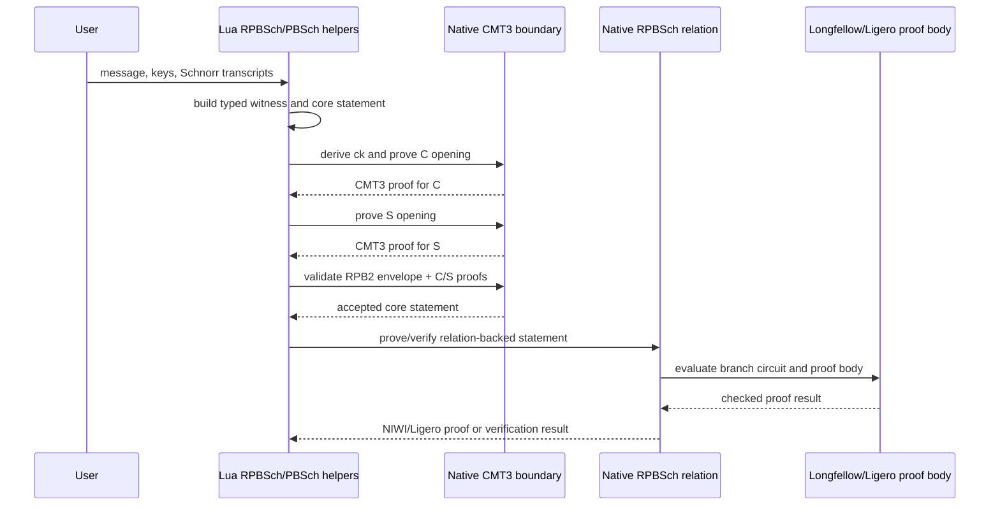
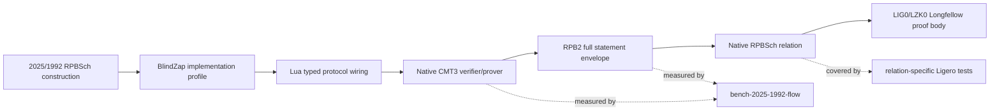

# BlindZap

BlindZap is Zenroom's implementation profile for the 2025 improved
concurrent-secure blind Schnorr signature construction.  It lives in
`lib/blindzap` and uses NIWI/Ligero machinery internally while preserving
wire-format names such as `RPBSch`, `NIWI`, `CMT3`, `LIG0`, and `LZK0` where
those names identify protocol objects.

The current production path is relation-backed: Lua builds typed statements and
witnesses, native code evaluates the selected relation, and accepted proofs
carry checked Ligero/Longfellow proof bodies where available.

## PBSch Cmt profiles

PBSch/RPBSch uses a Pedersen commitment over secp256k1:

```
C = m * G + rho * H
```

`G` is the secp256k1 generator. `H` is derived deterministically as the even-y
lift of `SHA-256("Zenroom/PBSch/PedersenH/v1" || iteration)`.

Lua PBSch/RPBSch code must treat secp256k1 scalar arithmetic as part of the
`SECP` API. Use `SECP.bip340_scalar_add`, `SECP.bip340_scalar_mul`,
`SECP.bip340_scalar_negate`, and `SECP.bip340_scalar_div` for scalar field
operations. Do not use Lua `BIG` for secp256k1 scalar algebra: in this runtime
`BIG` is a big-integer class tied to the BLS381 configuration, not the
secp256k1 field API.

The implementation keeps three versioned Cmt profiles:

| Profile | Status | Purpose | Default use |
| --- | --- | --- | --- |
| `CMT1` | compatibility/test | Private opening envelope `CMT1 || ck || message || rho`. It is straight-line extractable only from opened proof material already carried by the witness or test Gamma. | Unit tests and current native witness extraction internals. Not a paper-level public Cmt. |
| `CMT2` | compatibility/debug | Public Fiat-Shamir proof of a Pedersen opening, `CMT2 || ck || A || e || z_m || z_r`. It proves knowledge of an opening but is not the Fischlin/Pas straight-line extractable proof required by 2025-1992. | Debugging and regression tests. Do not use as the production RPBSch Cmt default once CMT3 is available. |
| `CMT3` | paper-level default | Pedersen commitment `c'` plus a Fischlin05 straight-line extractable proof of knowledge for the Pedersen opening. Initial parameters are `b=9`, `t=12`, `r=10`, `S=10`, matching the concrete profile discussed in `niwi/Fischl05b.pdf`. | Best paper-level default for PBSch/RPBSch production helpers. |

The active paper-level default should be `CMT3` whenever the API can carry a
public Cmt proof object. Keep `CMT1` and `CMT2` available for compatibility and
regression coverage, but do not claim paper-exact RPBSch for paths that only
use those profiles.

## Native protocol boundary

Lua expresses the paper protocol through typed records, envelopes, and readable
protocol wiring. C enforces algebra, transcript, and proof invariants. In
production paths, native code owns challenge loops, gate/tableau loops, SECP
arithmetic, binary transcript hashing, relation evaluation, CMT3
verification/extraction, and production proof bodies. Lua may assemble and name
protocol objects, but native APIs are the authority for cryptographic truth.

## How to switch profiles

Lua callers should use the profile-specific helpers in `src/lua/crypto_pbsch.lua`:

- `pbsch.cmt_commit`, `pbsch.cmt_verify`, and `pbsch.cmt_extract` operate on
  `CMT1` private openings.
- `pbsch.cmt2_prove`, `pbsch.cmt2_verify`, and `pbsch.cmt2_commit` operate on
  `CMT2` public Fiat-Shamir opening proofs.
- `pbsch.cmt3_prove`, `pbsch.cmt3_verify`, and `pbsch.cmt3_commit` operate on
  `CMT3` Fischlin05 opening proofs.

RPBSch production Lua helpers should validate the full Cmt proof object before
calling native NIWI proof generation. The native RPBSch Longfellow relation
continues to prove the algebraic Pedersen opening equations for the compressed
commitment points `C` and `S`.

The production RPBSch boundary is therefore the Lua relation-backed path, not
the low-level native C helpers by themselves. Lua must carry and validate the
`RPB2` envelope:

```
RPB2 || len(core_statement) || core_statement ||
        len(C_proof) || C_proof ||
        len(S_proof) || S_proof
```

before calling native relation proving or verification. Direct native calls are
building blocks for the relation and tests. The seeded native CMT3 prover is the
fast production-friendly generator for deterministic fixtures and future API
work; native CMT3 verification is currently only a fast accept path for native
seeded proofs, with Lua verification remaining the canonical verifier until
native verifier parity is proven against all Lua-generated CMT3 proofs.

Changing CMT3 parameters changes the proof system and must use a new profile id.
Do not silently change `b`, `t`, `r`, or `S` under
`pbsch-cmt-pedersen-fischlin05-v1`.

## Stable wire sizes

The following sizes are fixed by the current CMT3/RPB2 profile. They are byte
counts on the wire, not in-memory structure sizes.

| Object | Stable size | Source |
| --- | ---: | --- |
| `CMT3` proof | 1027 bytes | `NIWI_PBSCH_CMT3_PROOF_SIZE` in `src/pbsch_commitment.h` |
| `RPB2` full statement envelope | 2328 bytes | `NIWI_RPBSCH_FULL_STATEMENT_SIZE` in `src/pbsch_commitment.h` (`4 + 4 + 258 + 4 + 1027 + 4 + 1027`) |
| RPBSch core statement | 258 bytes | `NIWI_RPBSCH_CORE_STATEMENT_SIZE` in `src/pbsch_commitment.h` |
| Compressed `C` or `S` Pedersen commitment | 33 bytes | `NIWI_PBSCH_CMP_SIZE` in `src/pbsch_commitment.h` |
| `LIG0` native proof body | variable/profile-dependent | `src/niwi.c` sizes the body from tableau count and Merkle-path depth. |
| `LZK0` Longfellow/Ligero proof body | variable/profile-dependent | relation-specific serialized proof body in `src/niwi.c` and `src/relations/*.cc`. |

## Core relation entry points

- BIP340 relation: `lib/blindzap/src/relations/bip340_relation.cc`
- Generic zkcc P-256 relation: `lib/blindzap/src/relations/zkcc_p256_relation.cc`
- RPBSch relation: `lib/blindzap/src/relations/rpbsch_relation.cc`
- RPBSch Longfellow proof body:
  `lib/blindzap/src/relations/rpbsch_ligero_relation.cc`
- PBSch Pedersen primitive: `lib/blindzap/src/pbsch_commitment.c`

## Main tests

Run focused Cmt/RPBSch checks with:

```sh
./zenroom test/lua/pbsch_cmt.lua
./zenroom test/lua/pedersen.lua
./zenroom test/lua/rpbsch_niwi.lua
make -C lib/blindzap test
```

## 2025/1992 paper-flow benchmark

The public-boundary benchmark for the 2025/1992 RPBSch profile is:

```sh
make -C lib/blindzap bench-2025-1992-flow
```

It emits stable, grep-friendly rows like:

```text
BENCH paper_flow op=C_cmt3_prove_seeded iterations=20 total_ms=... per_us=... bytes_in=129 bytes_out=1027 rc=0
BENCH paper_flow op=RPB2_validate_full_statement iterations=100 total_ms=... per_us=... bytes_in=2328 bytes_out=2378 rc=0
```

The target measures native operations that form the current CMT3/RPB2 boundary:
commitment-key derivation, C/S Pedersen commitments, C/S CMT3 proof generation,
C/S CMT3 verification, full-statement envelope encoding, parsing, and validation.
Full RPBSch NIWI/Ligero proof-body timing remains covered by the relation-specific
Ligero tests because a valid NIWI witness requires the Longfellow circuit fixture,
not only the public C ABI.

## RPBSch profile flow




